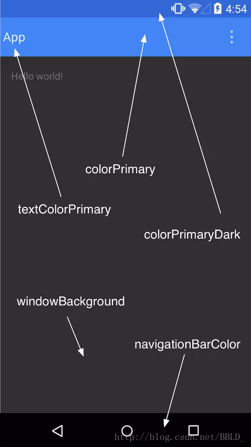

[TOC]

# 前言

自android5.0开始，AppCompatActivity代替ActionBarActivity，而且ToolBar也代替了ActionBar，下面就是ActionBar和ToolBar的使用


# 1、ActionBar


# 2、ActionBar的使用

## 2.1、 AppCompatActivity和其对应的Theme 


AppCompatActivity使用的是v7的ActionBar（和默认的ActionBar使用起来略有区别，一会代码中会有体现）

Theme的话继承于Theme.AppCompat.Light.DarkActionBar，系统提供的深色系的actionbar，那么按钮，文字，和菜单是白色的

## 2.2、获取ActionBar

```java
        //AppCompatActivity use v7 action bar
        actionBar = this.getSupportActionBar();
        //Activity use action bar
        //actionBar = this.getActionBar();

        if(actionBar == null){
            return;
        }
```

## 2.3、设置主副标题

```java
        //主标题
        actionBar.setTitle("ActionBar Title");
        //副标题
        actionBar.setSubtitle("Sub Title");	
```


## 2.4、 设置navigation up按钮 

```java
//左侧按钮：可见+可点击+更换图标
actionBar.setDisplayHomeAsUpEnabled(true);
actionBar.setHomeButtonEnabled(true);
actionBar.setHomeAsUpIndicator(R.drawable.fanhui);
```


## 2.5、 设置navigation up按钮的监听

复写onSupportNavigateUp()，如果复写了onOptionsItemSelected方法，则onSupportNavigateUp无用

```java
@Override
    public boolean onSupportNavigateUp() {
        finish();
        return super.onSupportNavigateUp();
    }
```

## 2.6、 设置logo（icon等） 

 用logo代替icon，不知道为什么不灵？？ 

```cpp
//设置logo
actionBar.setLogo(android.R.mipmap.sym_def_app_icon);
actionBar.setDisplayUseLogoEnabled(true);
//设置icon：use logo instead of an icon
//actionBar.setIcon(R.mipmap.ic_launcher);
```

## 2.7、 设置菜单menu和对应监听 

 android.R.id.home就是左侧的navigation up按钮 

```java
   /**
     * 复写：添加菜单布局
     */
    @Override
    public boolean onCreateOptionsMenu(Menu menu) {
        getMenuInflater().inflate(R.menu.menu, menu);
        return true;
    }

    /**
     * 复写：设置菜单监听
     */
    public boolean onOptionsItemSelected(MenuItem item) {
        switch (item.getItemId()) {
            //actionbar navigation up 按钮
            case android.R.id.home:
                finish();
                break;
            case R.id.action_refresh:
                Toast.makeText(this, "Refresh selected", Toast.LENGTH_SHORT).show();
                break;
            case R.id.action_add:
                Toast.makeText(this, "Add selected", Toast.LENGTH_SHORT).show();
                break;
            case R.id.action_settings:
                Toast.makeText(this, "Settings selected", Toast.LENGTH_SHORT).show();
                break;
            default:
                break;
        }
        return true;
    }
```

## 2.8、 设置tab和对应监听 

```java
        //增加actionbar 下面的tab按钮
        actionBar.setNavigationMode(ActionBar.NAVIGATION_MODE_TABS);
        actionBar.addTab(actionBar.newTab().setText("Tab 1").setTabListener(new ActionBar.TabListener() {
            @Override
            public void onTabSelected(ActionBar.Tab tab, FragmentTransaction fragmentTransaction) {
                Toast.makeText(MainActivity.this, "Tab 1 select", Toast.LENGTH_SHORT).show();
            }

            @Override
            public void onTabUnselected(ActionBar.Tab tab, FragmentTransaction fragmentTransaction) {
            }

            @Override
            public void onTabReselected(ActionBar.Tab tab, FragmentTransaction fragmentTransaction) {
            }
        }));
        actionBar.addTab(actionBar.newTab().setText("Tab 2").setTabListener(new ActionBar.TabListener() {
            @Override
            public void onTabSelected(ActionBar.Tab tab, FragmentTransaction fragmentTransaction) {
                Toast.makeText(MainActivity.this, "Tab 2 select", Toast.LENGTH_SHORT).show();
            }

            @Override
            public void onTabUnselected(ActionBar.Tab tab, FragmentTransaction fragmentTransaction) {
            }

            @Override
            public void onTabReselected(ActionBar.Tab tab, FragmentTransaction fragmentTransaction) {
            }
        }));

```

## 2.9、 或者完全自定义 

```cpp
//自定义
actionBar.setCustomView(R.layout.actionbar_title);
actionBar.setDisplayOptions(ActionBar.DISPLAY_SHOW_CUSTOM);
```

## 2.10、 隐藏、显示actionbar 

```java
public void click(View view) {
    switch (view.getId()) {
        case R.id.hide:
            if (actionBar != null) {
                /**
                 * 隐藏actionbar
                 * 1、有actionbar情况下：actionBar.hide();
                 * 2、直接使用Theme.Holo.NoActionBar
                 * 3、theme中添加属性
                 *      <item name="windowActionBar">false</item>
                 *      <item name="windowNoTitle">true</item>
                 * 4、在setContent之前 Window feature must be requested before adding content
                 *    AppCompatActivity: supportRequestWindowFeature(Window.FEATURE_NO_TITLE)，
                 *    Activity: requestWindowFeature(Window.FEATURE_NO_TITLE);
                 *
                 * */
                actionBar.hide();
            }
            break;

        case R.id.show:
            if (actionBar != null) {
                actionBar.show();
            }
            break;
    }
}
```
# 3、Menu（共通的菜单，不细说）

## 3.1、showAsAction属性

- always表示永远显示在ActionBar中，如果屏幕空间不够则无法显示
- ifRoom表示屏幕空间够的情况下显示在ActionBar中，不够的话就显示在overflow中
- never则表示永远显示在overflow中
- withText：这个值使菜单项和它的图标，文本一起显示

## 3.2、布局

```xml
<?xml version="1.0" encoding="utf-8"?>
<menu xmlns:app="http://schemas.android.com/apk/res-auto"
    xmlns:android="http://schemas.android.com/apk/res/android">
    <!--showAsAction属性
        always表示永远显示在ActionBar中，如果屏幕空间不够则无法显示
        ifRoom表示屏幕空间够的情况下显示在ActionBar中，不够的话就显示在overflow中
        never则表示永远显示在overflow中
        withText：这个值使菜单项和它的图标，文本一起显示-->

    <!--menuCategory：同种菜单项的种类。该属性可取4个值：container、system、secondary和alternative。-->

    <!--orderInCategor:同种类菜单的排列顺序。该属性需要设置一个整数值-->

    <item
        android:id="@+id/action_refresh"
        android:icon="@mipmap/refresh"
        android:title="Refresh"
        app:showAsAction="always" />
    <item
        android:id="@+id/action_add"
        android:icon="@mipmap/add"
        android:title="Add"
        app:showAsAction="ifRoom" />
    <item
        android:id="@+id/action_settings"
        android:icon="@mipmap/settings"
        android:title="Settings"
        app:showAsAction="never">
    </item>
</menu>
```


# 4、ToolBar

> [Android ToolBar 使用完全解析 - 简书](https://www.jianshu.com/p/ae0013a4f71a)
>
> [Toolbar的详细介绍和自定义Toolbar_移动开发_da_caoyuan的博客-CSDN博客](https://blog.csdn.net/da_caoyuan/article/details/79557704)


了解了ActionBar的话，那么ToolBar和其差不多，更加强大，更加符合MD风格，然后就代替ActionBar，使用起来差不多，但是又UI上的坑


ToolBar是Android 5.0推出的一个新的导航控件用于取代之前的ActionBar，由于其高度的可定制性、灵活性、具有Material Design风格等优点，越来越多的应用也用上了ToolBar，比如常用的知乎软件其顶部导航栏正是使用ToolBar。官方考虑到仍有一部分用户的手机版本号低于5.0，所以，ToolBar也放进了support v7包内，使得低版本的系统也能使用上ToolBar。

# 5、ToolBar的使用

## 5.1、引入包support v7支持包

```
implementation fileTree(dir: 'libs', include: ['*.jar']) //<-----
implementation 'androidx.appcompat:appcompat:1.1.0'
implementation 'androidx.constraintlayout:constraintlayout:1.1.3'
testImplementation 'junit:junit:4.12'
androidTestImplementation 'androidx.test.ext:junit:1.1.1'
androidTestImplementation 'androidx.test.espresso:espresso-core:3.2.0'
implementation 'com.android.support:appcompat-v7:28.0.0' //<------
```

## 5.2、更改主题

为了能够正常使用ToolBar，我们需要**隐藏原来的ActionBar**，这个可以在主题中修改，在values/styles.xml中做出如下修改：

```xml
<style name="AppTheme" parent="Theme.AppCompat.Light.NoActionBar"></style>
```

继承了Theme.Appcompat.Light.NoActionBar主题，这里提一下，这个Theme.AppCompat是支持包内的主题，对应着5.0版本的Theme.Material主题。然后在manifest文件中引用这个主题。

在布局文件中创建这个控件，activity_main.xml文件中，代码如下所示：

```java
<FrameLayout xmlns:android="http://schemas.android.com/apk/res/android"
    android:layout_width="match_parent"
    android:layout_height="match_parent">
    <android.support.v7.widget.Toolbar
        android:id="@+id/toolbar"
        android:layout_width="wrap_content"
        android:layout_height="wrap_content">
        <TextView
            android:layout_width="match_parent"
            android:layout_height="wrap_content"
            android:text="标题"
            android:textSize="20sp"/>
    </android.support.v7.widget.Toolbar>
</FrameLayout>
```


在上面，创建了android.support.v7.widget.Toolbar，同时我们在内部放了一个TextView，这是与ActionBar最大的不同，因为ToolBar实际上是一个ViewGroup，支持在其内部放入子View。


## 5.3、更改Toolbar的颜色

 直接在布局文件中添加一个backgroud属性指定颜色就可以了，但是为了全局考虑，我们可以这样：在values/styles.xml文件中做出如下修改： 

```xml
<resources>
    <style name="AppTheme" parent="Theme.AppCompat.Light.NoActionBar">
        <!-- Customize your theme here. -->
        <item name="colorPrimary">#2e8abb</item> <!--浅蓝色-->
        <item name="colorPrimaryDark">#3A5FCD</item> <!--深蓝色-->
    </style>
</resources>
```

然后在布局文件中，添加如下属性：

```xml
android:background="?attr/colorPrimary"
```


可以看到，颜色已经改变，同时我们注意到，顶部状态栏的颜色也变成了深蓝色，这是因为添加了"colorPrimaryDark"的属性，使得顶部状态栏随之改变，利用这一特性，我们可以轻松实现“状态栏沉浸”的效果了。当然，这只适用于Android 5.0以上，如果在低版本则这个属性无效。这里再附上一张图（图片来自[http://blog.csdn.net/bbld_/article/details/41439715](https://link.jianshu.com?t=http://blog.csdn.net/bbld_/article/details/41439715)



也可以这样：

```xml
    <androidx.appcompat.widget.Toolbar
        android:id="@+id/toolbar"
        android:logo="@mipmap/ic_launcher"
        android:subtitle="Sub Title"
        android:title="Title"
        android:titleTextColor="#ffffff"
        android:layout_width="match_parent"
        android:layout_height="wrap_content">
        android:background="?attr/colorPrimary">

    </androidx.appcompat.widget.Toolbar>	
```

# 6、ToolBar添加菜单选项图标及点击事件

## 6.1、添加菜单选项图标

```xml
<?xml version="1.0" encoding="utf-8"?>
<menu xmlns:android="http://schemas.android.com/apk/res/android"
    xmlns:app="http://schemas.android.com/apk/res-auto">
    <item
        android:id="@+id/action_search"
        android:icon="@drawable/search"
        android:title="Search"
        app:showAsAction="ifRoom" />
    <item
        android:id="@+id/action_notifications"
        android:icon="@drawable/notifications"
        android:title="notifications"
        app:showAsAction="ifRoom" />
    <item
        android:id="@+id/action_settings"
        android:icon="@drawable/settings"
        android:orderInCategory="100"
        android:title="设置"
        app:showAsAction="never" />
</menu>
```

这里用了这样一个熟悉：app:showAsAction="ifRoom"/"never"，app是自定义的命名空间，因为我们的activity继承的是AppCompatActivity，是support v7包的，并不是原生sdk内部的，因此不能使用android:showAsAction，否则会报错。然后ifRoom表示有空间则显示，never表示从不显示，而是会通过overflowwindow显示。
 接着我们在Activity中，要重写onCreateOptionsMenu()方法，把这个菜单加载进去：


```java
@Override
public boolean onCreateOptionsMenu(Menu menu) { 
       getMenuInflater().inflate(R.menu.menu_main, menu);   
       return true;
}
```

## 6.2 添加点击事件

```java
//设置导航图标、添加菜单点击事件要在setSupportActionBar方法之后
        setSupportActionBar(toolbar);
        toolbar.setNavigationIcon(R.mipmap.ic_drawer_home);

        toolbar.setOnMenuItemClickListener(new Toolbar.OnMenuItemClickListener() {
            @Override
            public boolean onMenuItemClick(MenuItem item) {
                switch (item.getItemId()) {
                    case R.id.action_search:
                        Toast.makeText(MainActivity.this, "Search !", Toast.LENGTH_SHORT).show();
                        break;
                    case R.id.action_notifications:
                        Toast.makeText(MainActivity.this, "Notificationa !", Toast.LENGTH_SHORT).show();
                        break;
                    case R.id.action_settings:
                        Toast.makeText(MainActivity.this, "Settings !", Toast.LENGTH_SHORT).show();
                        break;
                }
                return true;
            }
});
```


 右上角的三个圆点，是黑色的，与图标格格不入，有没有什么办法改变它呢？答案是有的，可以通过添加样式改变，如下所示： 

## 5.4、 溢出菜单图标（三个点）

Android开发中我们很多时候需要Toolbar的背景、溢出菜单图标（三个小点）和弹出菜单的背景颜色都是白色。如果用亮色主题Toolbar，文字和溢出菜单图标颜色会成黑色，一般这个时候我们会单独对Toolbar设置一个黑色主题，但是这样弹出菜单也会随之变成黑色，这时候我们又需要单独设置弹出菜单的主题，这样做很复杂。

```xml
<style name="toolbar">
	<item name="android:colorControlNormal">#ffffff</item>
</style>
加上
android:theme="@style/toolbar"
```


## 6.3 修改Toolbar popup menu样式

 右上角的popup menu是白底黑字，那么有没有什么办法改变它的背景颜色，使菜单显示为黑底白字呢呢？ 

首先在styles.xml文件中，新建一个主题：

```xml
<!-- toolbar弹出菜单样式 -->
<style name="ToolbarPopupTheme" parent="@style/ThemeOverlay.AppCompat.Dark">   
     <item name="android:colorBackground">#000000</item>
</style>
```

可以看到这个主题的parent是直接继承自ThemeOverlay.AppCompat.Dark，是支持包的一个主题，并且我们在内部声明了“android:colorBackground”这个属性，我们只要更改这个属性就能变更菜单的背景颜色了。接下来我们在布局文件中引入这个主题，这也很简单，为toolbar添加额外的属性如下：


```java
toolbar:popupTheme="@style/ToolbarPopupTheme"
```

这样，改几行代码即可修改popup menu的背景颜色了，如下面所示：

## 6.4、修改Toolbar popup menu 弹出位置

```xml
    <style name="ToolbarPopupTheme" parent="@style/ThemeOverlay.AppCompat.Dark">
        <item name="android:colorBackground">#000000</item>
        <item name="actionOverflowMenuStyle">@style/OverflowMenuStyle</item> <!--新增一个item，用于控制menu-->
    </style>
    <style name="OverflowMenuStyle" parent="Widget.AppCompat.Light.PopupMenu.Overflow">
        <item name="overlapAnchor">false</item>  <!--把该属性改为false即可使menu位置位于toolbar之下-->
    </style>
```

