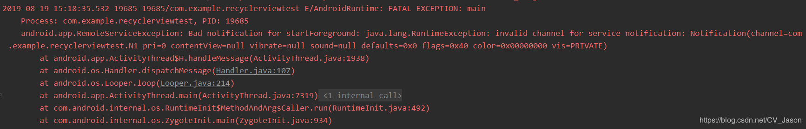
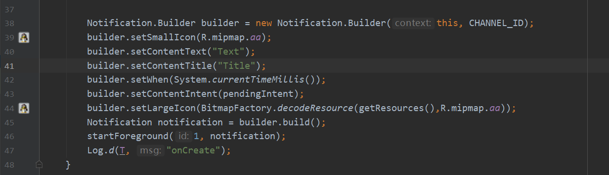
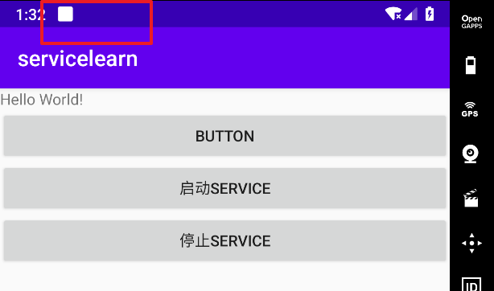
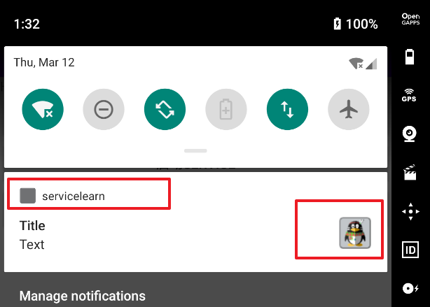
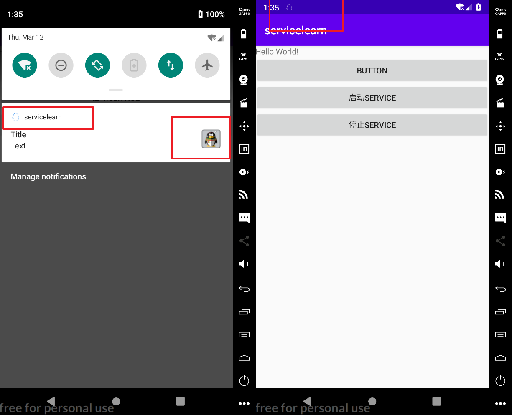
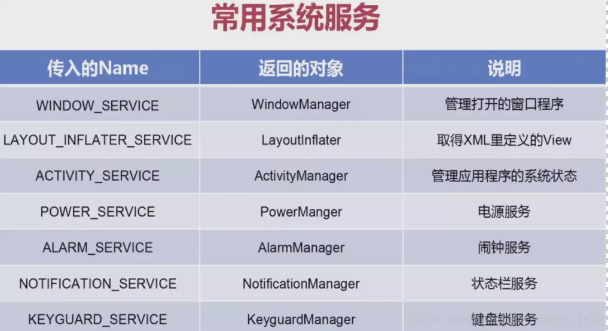
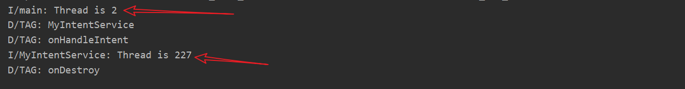
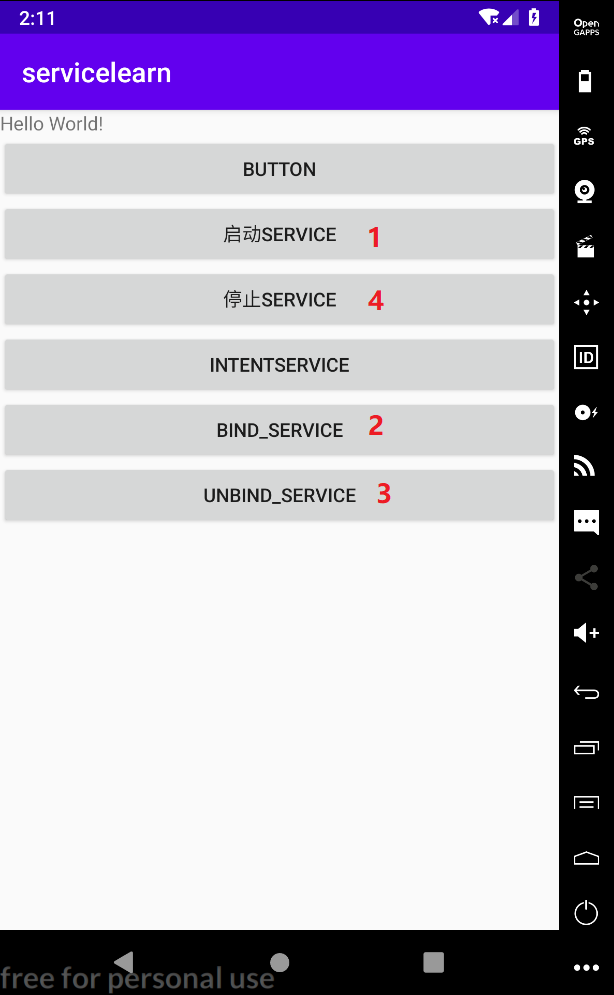

#  **普通Service**

```java
package com.zzu.rensiyu.servicelearn;

import android.app.Service;
import android.content.Intent;
import android.os.IBinder;
import android.util.Log;


public class MyService extends Service {
    private String T = "TAG";

    public MyService() {
    }
    @Override
    public void onCreate() {
        super.onCreate();
        Log.d(T, "onCreate");
    }
    @Override
    public int onStartCommand(Intent intent, int flags, int startId) {
        Log.d(T, "onStartCommand");
        return super.onStartCommand(intent, flags, startId);
    }
    @Override
    public void onDestroy() {
        super.onDestroy();
        Log.d(T, "onDestroy");
    }
    @Override
    public IBinder onBind(Intent intent) {
        Log.d(T, "onBind");
        return null;
    }
}

```

```java
button1.setOnClickListener(v -> {
    Intent intent = new Intent(this, MyService.class);
    startService(intent);
});
button2.setOnClickListener(v -> {
    Intent intent = new Intent(this, MyService.class);
    stopService(intent);
});
```

```xml
<service
         android:name=".MyService"
         android:enabled="true"
         android:exported="true"></service>
```

> D/TAG: onCreate
> D/TAG: onStartCommand
> D/TAG: onDestroy
> D/TAG: onCreate
> D/TAG: onStartCommand
> D/TAG: onDestroy

# 前台Service

```java
package com.zzu.rensiyu.servicelearn;

import android.app.Notification;
import android.app.Service;
import android.content.Intent;
import android.os.IBinder;
import android.util.Log;


public class MyService extends Service {
    private String T = "TAG";

    public MyService() {
    }

    @Override
    public void onCreate() {
        super.onCreate();
        // 使用前台服务
        Notification.Builder builder = new Notification.Builder(this);
        builder.setSmallIcon(R.mipmap.ic_launcher);
        builder.setContentText("Text");
        builder.setContentTitle("Title");
        builder.setWhen(System.currentTimeMillis());
        Notification notification = builder.build();
        startForeground(1, notification);
        Log.d(T, "onCreate");
    }

    @Override
    public int onStartCommand(Intent intent, int flags, int startId) {
        Log.d(T, "onStartCommand");
        return super.onStartCommand(intent, flags, startId);
    }

    @Override
    public void onDestroy() {
        super.onDestroy();
        Log.d(T, "onDestroy");
    }

    @Override
    public boolean onUnbind(Intent intent) {
        Log.d(T, "onUnbind");
        return super.onUnbind(intent);
    }

    @Override
    public void onRebind(Intent intent) {
        super.onRebind(intent);
        Log.d(T, "onRebind");
    }

    @Override
    public IBinder onBind(Intent intent) {
        Log.d(T, "onBind");
        return null;
    }
}

```

```xml
API28以后，申请前台服务需要静态注册权限，不然的话会报错
<uses-permission android:name="android.permission.FOREGROUND_SERVICE"></uses-permission>
```


> 报了个错：Bad notification for startForeground: java.lang.RuntimeException: ==invalid channel for service notification==: Notification(channel=null pri=0 contentView=null vibrate=null sound=null defaults=0x0 flags=0x40 color=0x00000000 vis=PRIVATE)
>
> 解决办法：
>
> [java.lang.RuntimeException: invalid channel for service notification_Java_写给自己的诗-CSDN博客](https://blog.csdn.net/CV_Jason/article/details/99731979)










**至于setSmallIcon图片无效参考：**

[Notification中setSmallIcon为什么没有效果 - 简书](https://www.jianshu.com/p/5eb57651ec76)

[Android通知栏微技巧，那些你所没关注过的小细节_移动开发_郭霖的专栏-CSDN博客](https://blog.csdn.net/guolin_blog/article/details/50945228)



**修改后的代码**

```java
Notification.Builder builder = new Notification.Builder(this, CHANNEL_ID);
builder.setSmallIcon(R.mipmap.qq);
builder.setColor(Color.parseColor("#3385ff"));
builder.setContentText("Text");
builder.setContentTitle("Title");
builder.setWhen(System.currentTimeMillis());
builder.setContentIntent(pendingIntent);
builder.setLargeIcon(BitmapFactory.decodeResource(getResources(), R.mipmap.aa));
Notification notification = builder.build();
startForeground(1, notification);
```


#  **系统Service** 

参考——[学习笔记| AS入门（十） 组件篇之Service - 简书](https://www.jianshu.com/p/1959eb5c99f5)

除了自定义一个Service，当然还有现有的系统服务，比如之前接触过的NotificationManage。通过**getSyetemService()**方法并传入一个Name就可以得到相应的服务对象了，常用的系统服务如下表：




。。。


#  **IntentService** 

为了可以简单地创建一个**异步的、会自动停止**的服务，Android 专门提供了一个IntentService类。它的使用和普通Service非常像，下面来学习一下：

第一步：新建类并继承IntentService，在这里需要提供一个无参的构造函数且必须在其内部调用父类的有参构造函数，然后具体实现 **onHandleIntent()**方法，在里可以去处理一些耗时操作而不用担心 ANR的问题，因为这个方法已经是在子线程中运行的了。
 第二步：在配置文件中进行注册。
 第三步：在活动中利用Intent实现IntentService的启动，和Service用的方法是完全一样的。

再来实战，定义一个MyIntentService，准备好无参构造函数，并重写onHandleIntent()方法，这里打印了一行日志，为了证实这个方法确实已经在子线程，又打印了当前线程的id。另外，根据IntentService的特性，这个服务在运行结束后应该是会自动停止的，所以重写onDestroy()方法，在这里也打印了一行日志，以证实服务是不是停止掉了。


1. 创建IntentService

```java
package com.zzu.rensiyu.servicelearn;

import android.app.IntentService;
import android.content.Intent;
import android.util.Log;

public class MyIntentService extends IntentService {
    public MyIntentService() {
        super("MyIntentService");
        Log.d("TAG", "MyIntentService");
    }

    @Override
    protected void onHandleIntent(Intent intent) {
        Log.d("TAG", "onHandleIntent");
        Log.i("MyIntentService", "Thread is " + Thread.currentThread().getId());
    }

    @Override
    public void onDestroy() {
        Log.d("TAG", "onDestroy");
        super.onDestroy();
    }
}

```

2. 注册

```xml
<service
         android:name=".MyIntentService"
         android:exported="false"></service>
```


3. 最后

```java
button3.setOnClickListener(v -> {
    Intent intent = new Intent(this, MyIntentService.class);
    startService(intent);
    Log.i("main", "Thread is " + Thread.currentThread().getId());
});
```





#  **Service与Activity的通信**

让Service与Activity进行通信。这就需要借助服务的**onBind()**方法了。比如希望在MyService里提供一个下载功能，然后在活动中可以决定何时开始下载，以及随时查看下载进度。一起学习一下：


1. 第一步：在MyService里自定义一个类MyBinder并继承**Binder**，在它的内部提供了开始下载以及查看下载进度的方法，为了模拟一下，这里就分别打印了一行日志。 

```java
//内部类
class MyBinder extends Binder {
    void createProgressDialog() {
        Log.i("MyBinder", "createProgressDialog");
    }

    void onProgressUpdate() {
        Log.i("MyBinder", "onProgressUpdate");
    }

}
```

2. 第二步：在MyService的**onBind()**方法里返回刚刚定义好的MyBinder类。 

```java
private MyBinder binder = new MyBinder();

@Override
public IBinder onBind(Intent intent) {
    Log.i("MyService", "onBind");
        return binder;
}
```


3. 第三步：在活动中(**MainActivity**)实例化一个ServiceConnection类，并重写它的**onServiceConnection()**和**onServiceDisconnection()**方法，这两个方法分别会在活动与服务成功绑定以及解除绑定的时候调用。在 onServiceConnected()方法中，又通过向下转型得到了MyBinder 的实例，有了它活动和服务之间的关系就变得非常紧密了。现在可以在活动中根据具体的场景来调用MyBinder中的任何非private方法了。这里简单调用
   MyBinder中的两个模拟方法。

```java
 private MyService.MyBinder binder;
    private ServiceConnection connection = new ServiceConnection() {
        @Override
        public void onServiceConnected(ComponentName name, IBinder service) {
            binder = (MyService.MyBinder) service;
            binder.createProgressDialog();
            binder.onProgressUpdate();
        }

        @Override
        public void onServiceDisconnected(ComponentName name) {
        }
    };


```


4. 第四步：在活动布局里再准备两个按钮用于绑定和解绑服务，在它们的点击事件里利用Intent对象实现活动和服务的绑定和解绑。方法是：**bindService()**实现绑定，它接收三个参数（Intent对象，ServiceConnection对象，标志位），这里传入**BIND_AUTO_CREATE**表示在活动和服务进行绑定后自动创建服务。**unbindService()**实现解绑，传入ServiceConnection对象就可以了。

```java
button4.setOnClickListener(v -> {
    Intent intent = new Intent(this, MyService.class);
    bindService(intent, connection, BIND_AUTO_CREATE);
});
button5.setOnClickListener(v -> {
    Intent intent = new Intent(this, MyService.class);
    unbindService(connection);
});
```




```
1
I/MyService: onCreate
    onStartCommand
2  
I/MyService: onBind
I/MyBinder: createProgressDialog
    onProgressUpdate
3 
I/MyService: onUnbind
4
I/MyService: onDestroy
```


```
1
I/MyService: onCreate
I/MyService: onBind
I/MyBinder: createProgressDialog
    onProgressUpdate
2 
I/MyService: onUnbind
I/MyService: onDestroy
```


老师，我有几个疑惑想问您

1. 音乐播放器 （播放按钮）按下后