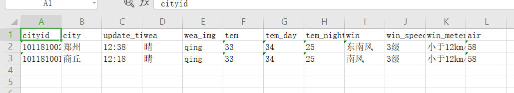

# 1. 先解决包问题

 https://github.com/andruhon/android5xlsx 

导入 poi-3.12-android-a.jar
 poi-ooxml-schemas-3.12-20150511-a.jar这两个jar包

# 2. 写代码

```java
    public static void createExcel(JSONArray jsonArray, String[] excelTitle) {
        //创建工作簿
        XSSFWorkbook xssfWorkbook = null;
        xssfWorkbook = new XSSFWorkbook();

        //创建工作表
        XSSFSheet xssfSheet;
        xssfSheet = xssfWorkbook.createSheet();

        //创建行
        XSSFRow xssfRow;

        //创建列，即单元格Cell
        XSSFCell xssfCell = null;

        String path = Environment.getExternalStorageDirectory().toString() + "/test.xls";
        Log.e("path", path);
        File file = new File(Environment.getExternalStorageDirectory().
                toString() + "/test.xls");
        //创建文件
        if (!file.exists()) {
            try {
                file.createNewFile();
            } catch (IOException e) {
                e.printStackTrace();
            }

        }
        int t = 0;
        try {
            outputStream = new FileOutputStream(file);

            //单独拉出来写标题
            if (t == 0) {
                xssfRow = xssfSheet.createRow(t);
                t++;
                for (int i = 0; i < excelTitle.length; i++) {
                    xssfCell = xssfRow.createCell(i); //创建单元格
                    xssfCell.setCellValue(excelTitle[i]);
                }
            }
			//写内容
            for (int i = 0; i < jsonArray.length(); i++) {
                JSONObject jsonObject = jsonArray.getJSONObject(i);
                xssfRow = xssfSheet.createRow(t++);
                for (int j = 0; j < excelTitle.length; j++) {
                    xssfRow.createCell(j).setCellValue(jsonObject.getString(excelTitle[j]));
                }
            }
        } catch (FileNotFoundException e) {
            Log.e("ExcelUtil", "找不到json文件");
            e.printStackTrace();
        } catch (JSONException e) {
            Log.e("ExcelUtil", "jsonArray.getJSONObject(i);发生错误");
            e.printStackTrace();
        } finally {
            //用输出流写到excel
            try {
                xssfWorkbook.write(outputStream);
                outputStream.flush();
                outputStream.close();
            } catch (IOException e) {
                e.printStackTrace();
            }

        }

    }
```

参考——[java用XSSFWorkbook实现读写Excel - 那心之所向 - 博客园](https://www.cnblogs.com/janson071/p/10119935.html)


