# 1、安卓支持的多媒体格式


| Type  | File type support                                    |
| ----- | ---------------------------------------------------- |
| Audio | 3GPP（.3gp）、MP3（.mp3）、OGG（.ogg）、WAVE（.wav） |
| Image | JPEG（.jpg）、GIF（.gif）、PNG（.png）、BMP（.bmp）  |
| Video | 3GPP（.3gp）MPEG-4（.mp4）                           |


# 2、Mediaplayer的主要方法

```java
*	create():创建一个要播放的多媒体文件
*   getCurrentPosition( )：得到当前的播放位置
*   getDuration() ：得到文件的时间
    getVideoHeight() ：得到视频高度
    getVideoWidth() ：得到视频宽度
    isLooping()：是否循环播放
    isPlaying()：是否正在播放
*   pause()：暂停
*   prepare()：准备(同步)
*   prepareAsync()：准备(异步)
*   release()：释放MediaPlayer对象
*   reset()：重置MediaPlayer对象
*   seekTo(int msec)：指定播放的位置(以毫秒为单位的时间)
*   setAudioStreamType(int streamtype)：指定流媒体的类型(AudioManager.STREAM_MUSIC)
    setDisplay(SurfaceHolder sh)：设置用SurfaceHolder来显示多媒体
*   setLooping(boolean looping)：设置是否循环播放
    setOnBufferingUpdateListener(MediaPlayer.OnBufferingUpdateListener listener)： 网络流媒体的缓冲监听
    setOnCompletionListener(MediaPlayer.OnCompletionListener listener)： 网络流媒体播放结束监听
*   setOnErrorListener(MediaPlayer.OnErrorListener listener)： 设置错误信息监听
    setOnVideoSizeChangedListener(MediaPlayer.OnVideoSizeChangedListener listener)： 视频尺寸监听
    setScreenOnWhilePlaying(boolean screenOn)：设置是否使用SurfaceHolder显示
    setVolume(float leftVolume, float rightVolume)：设置音量
*   start()：开始播放
*   stop()：停止播放
```


# 3、如何使用MediaPlayer

1. 获得mediaPlayer实例的方法

```java
//获得mediaPlayer实例的方法
MediaPlayer mediaPlayer = new MediaPlayer();
mediaPlayer.setDataSource();
	setDataSource(Context, Uri)
    setDataSource(Context, Uri, Map<String, String>, List<HttpCookie>)
    setDataSource(String)

//使用create就不需要setDataSource
MediaPlayer.create();
	create(Context, Uri)
    create(Context, int)
```
2. 如何设置播放文件

MediaPlayer要播放的文件有三种来源：

- 应用中事先自带的resource资源

-  存储在SD卡或其他文件路径下的媒体文件
- 网络上的媒体文件

可以通过setDataSource()方法来装载指定的音频文件：

```java
//①raw下的资源：
MediaPlayer.create(this, R.raw.test);

//②本地文件路径：
mp.setDataSource("/sdcard/test.mp3");

//③网络URL文件：
mp.setDataSource("http://www.xxx.com/music/test.mp3");

setDataSource(Context, Uri)
setDataSource(Context, Uri, Map<String, String>, List<HttpCookie>)
setDataSource(String)
setDataSource(AssetFileDescriptor)
setDataSource(FileDescriptor)
setDataSource(FileDescriptor, long, long)
setDataSource(MediaDataSource)
```


3. 对播放器的主要控制方法

- start()
- isPlaying()
- seekTo()

seekTo()方法可以调整播放位置，seekTo()方法是异步的，尤其是播放网络流媒体时延时很明显。实际定位完成后，通过`OnSeekComplete.onSeekComplete()`通知。“活动状态”(Prepared、Started、Paused、PlaybackCompleted状态)下都可以调用seekTo()方法。 播放器引擎会回调 OnSeekComplete.onSeekComplete()方法, 该方法通过 `setOnSeekCompleteListener()` 方法注册; 

- release()
- prepare()和prepareAsync()
- reset() 重置到未初始化状态，可以是播放器回恢复未初始化状态，重新回到Idle状态。


4. 设置监听

```java
mediaPlayer.setOnCompletionListener();
mediaPlayer.setOnErrorListener();	
```


# 4、mediaplayer状态装换图

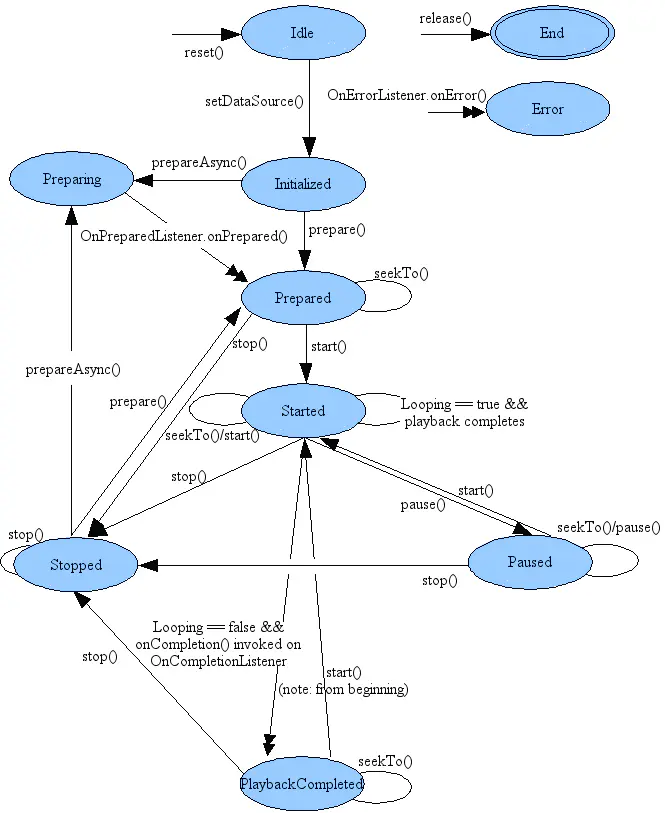


# 5、MediaPlayer生命周期状态

每种方法只能在特定的方式下使用，如果使用mediaplayer的状态不正确会引发`IllegalStateException`异常 。


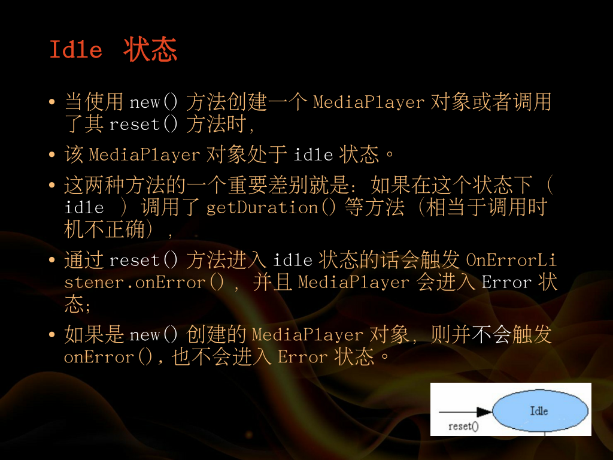

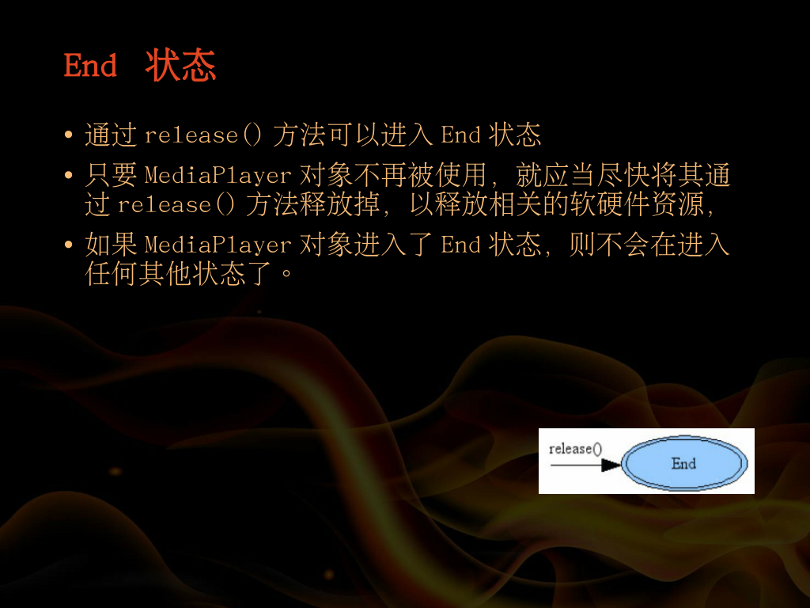

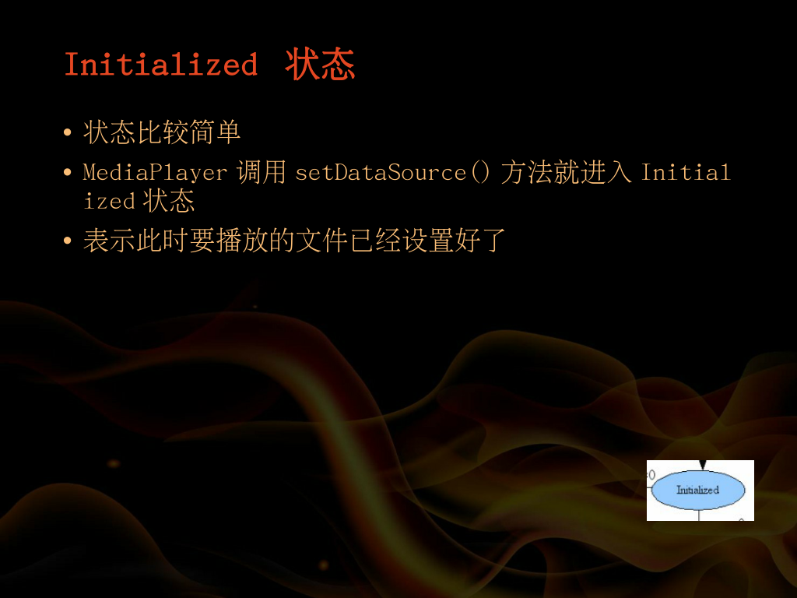

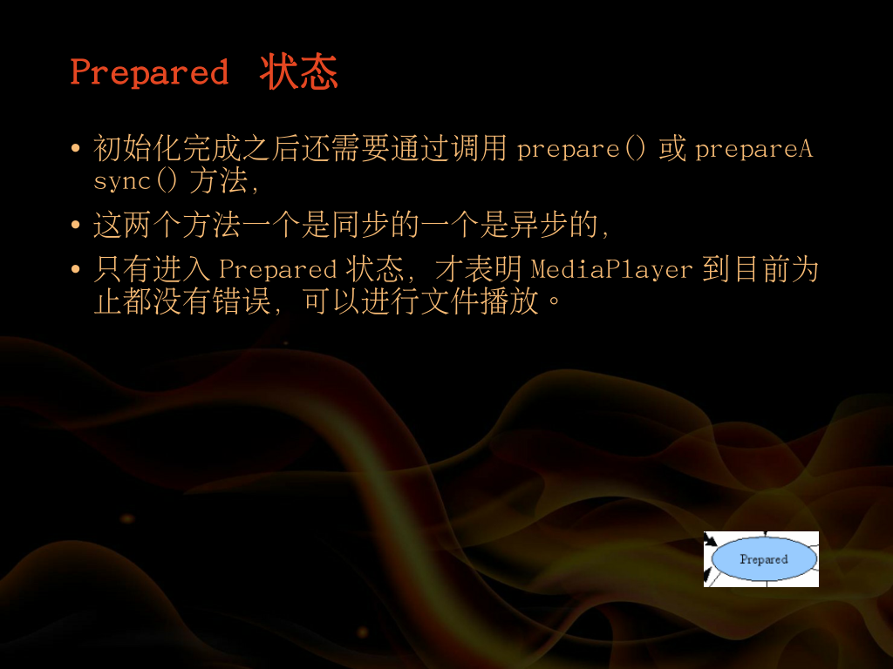

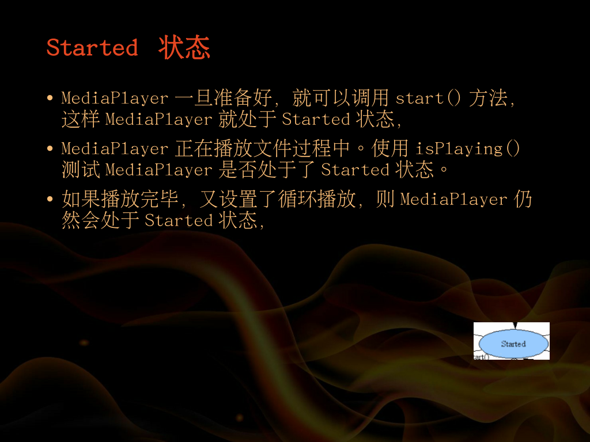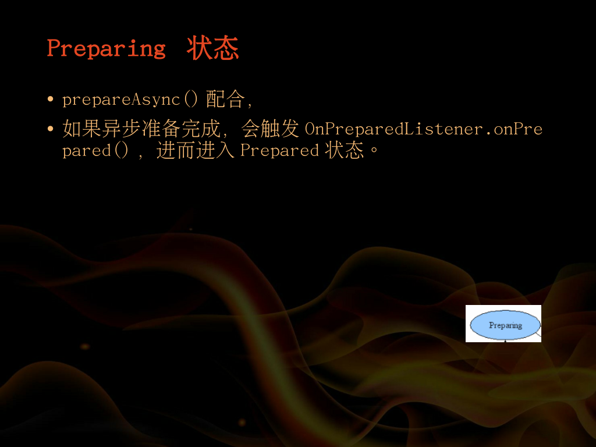

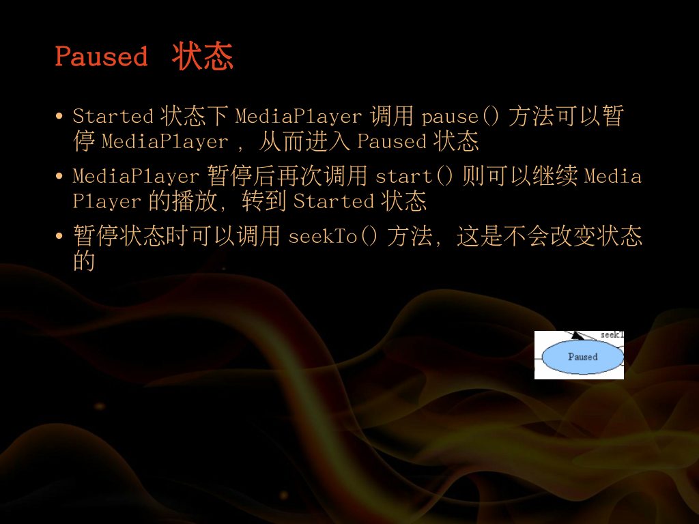

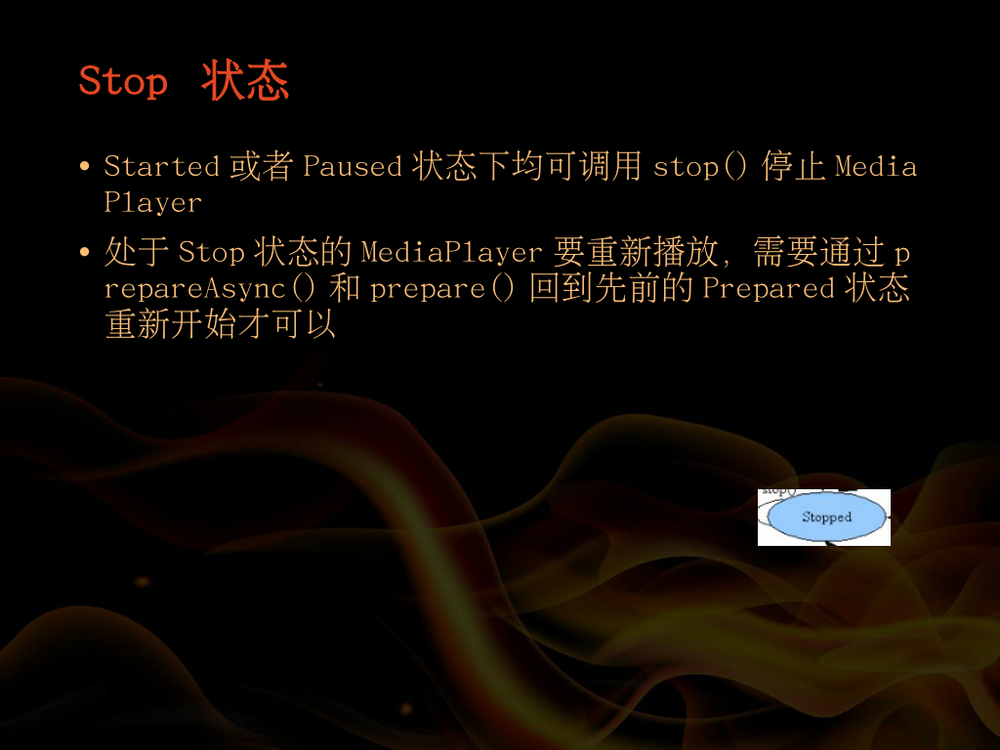

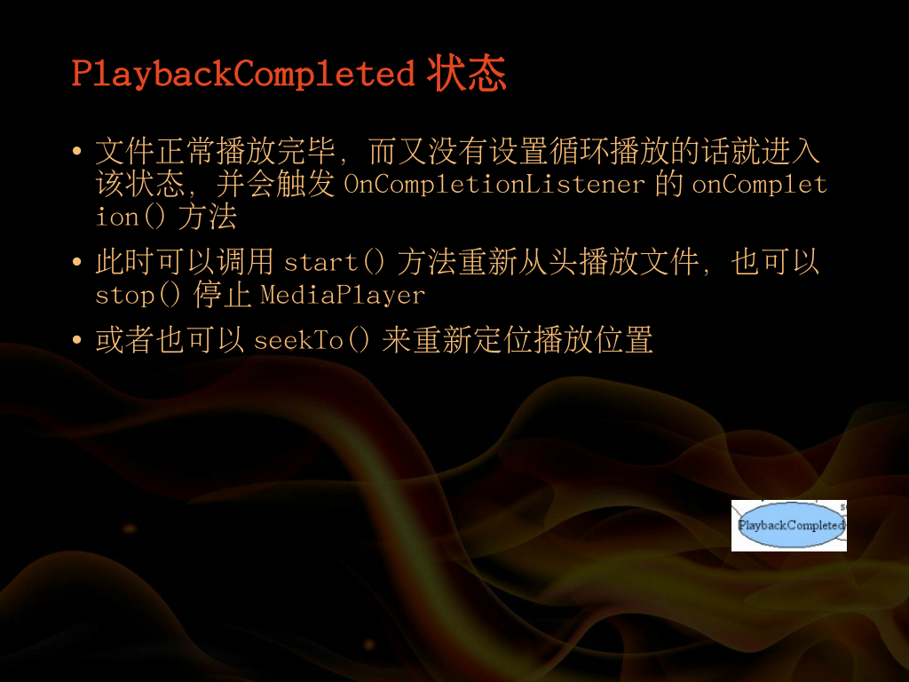

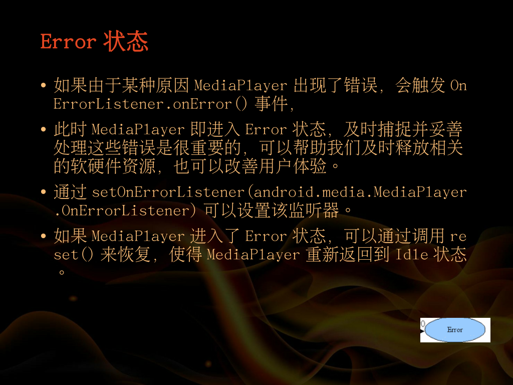

 

# 6、状态转换图


椭圆代表MediaPlayer可能驻留的状态

弧线表示MediaPlayer的播放控制操作

这里有两种类型的弧线，单箭头弧线代表同步方法调用，双箭头弧线代表异步方法调用


**MediaPlayer是基于状态的，只有在特定的状态下才能执行特定的方法。所以认清状态很重要**

1. Idle（闲置）状态与End（结束）状态

- mp通过new方法初始化，或者调用reset方法后，mp处于Idle状态
- 调用release方法后处于end状态，end状态是最后一个状态，不能转换其他状态。这两种状态之间是MediaPlayer对象的生命周期。
- create方法初始化的Mediaplayer直接进入Prepare状态。

2. Error状态

- 进入Error状态：检查到异常，系统回调onError()进入Error状态。
- 离开Error状态：调用`reset()`回到Idle状态。
- 注册监听：`mediaPlayer.setOnErrorListener();`

3. Initialized(初始化状态)

- 只有在Idle状态下，调用`setDataSource()`，Mediaplayer会迁移到initialized状态。

4. Prepared和Preparing

- Initialized状态调用`prepared()`进入Prepared状态（同步操作，若数据量较大，会阻塞主线程）

- Initialized状态调用`prepareAsync()`进入preparing状态，注册`setOnPreparedListener`，在`onPrepared()`方法中操作，（异步操作，便于更大的数据量，避免主线程阻塞）

  ```java
  mediaPlayer.setOnPreparedListener(new MediaPlayer.OnPreparedListener() {
      @Override
      public void onPrepared(MediaPlayer mediaPlayer) {
  
      }
  });
  ```

5. Started状态

- prepared状态调用`start()`方法进入Started状态

- 判断MediaPlayer是否在start状态`isPlaying()`

- 跟踪缓冲状态：

  在Started状态中，调用，下面的方法可以获取视频音频的缓冲状态

  ```java
  mediaPlayer.setOnBufferingUpdateListener(new MediaPlayer.OnBufferingUpdateListener() {
      @Override
      public void onBufferingUpdate(MediaPlayer mediaPlayer, int i) {
  
      }
  });
  ```


 

6. Paused状态

- paused状态转移
- Started状态调用`paused()`进入Paused状态
- Paused状态调用`Start()`进入Started状态

7. Stoped状态

- 在Prepared、Started、Paused、PlaybackCompleted状态下调用`stop()`方法，MediaPlayer会迁移到Stoped状态。
- Stoped状态不能直接`start()`，要返回Prepared状态（`prepare()\prepareAsyn()`），才能调用`start()`

8. PlaybackCompleted状态

- PlaybackCompleted状态转移：如果设置了循环播放模式，那么播放完毕后，会直接重新进入Started状态

- 若没哟设置`SetLooping()`，播放完毕会调用OnCompletionListener.onCompletion回调方法，MediaPlayer会进入PlaybackCompleted状态。

  ```java
  mediaPlayer.setOnCompletionListener(new MediaPlayer.OnCompletionListener() {
      @Override
      public void onCompletion(MediaPlayer mediaPlayer) {
  
      }
  });
  ```

- 该状态可以直接调用`start()`


