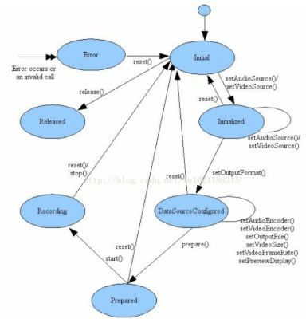
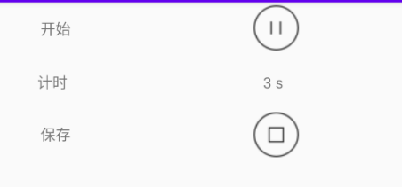

# MediaRecoder

MediaRecoder是安卓面向应用层的封装，用于提供便捷的音视频编码封装操作，在使用的过程中要严格的按照官方指定的生命周期调用顺序。



**使用步骤：**

可以参考——[Android 录音实现--MediaRecorder - 简书](https://www.jianshu.com/p/9f70197f79a8)


# 1、权限

```java
requestPermissions(new String[]{Manifest.permission.RECORD_AUDIO,
                                Manifest.permission.WRITE_EXTERNAL_STORAGE}, 0x123);
@Override
public void onRequestPermissionsResult(int requestCode, @NonNull String[] permissions, @NonNull int[] grantResults) {
    if (requestCode == 0x123 && grantResults[0] == PackageManager.PERMISSION_GRANTED
        && grantResults[1] == PackageManager.PERMISSION_GRANTED) {
    }
}
```


# 2、开始录音

```java
mediaRecorder = new MediaRecorder();
//设置音频格式
mediaRecorder.setAudioSource(MediaRecorder.AudioSource.MIC);
//设置音频输出后的保存格式
mediaRecorder.setOutputFormat(MediaRecorder.OutputFormat.MPEG_4);
//设置音频编码格式
mediaRecorder.setAudioEncoder(MediaRecorder.AudioEncoder.AMR_NB);
/**
//设置音频通道号
mMediaRecorder.setAudioChannels(1);
//设置录音文件的清晰度
mMediaRecorder.setAudioSamplingRate(44100);
mMediaRecorder.setAudioEncodingBitRate(192000);
**/
//指定一个输出文件
mediaRecorder.setOutputFile(file.getAbsolutePath());
try {
    mediaRecorder.prepare();
} catch (IOException e) {
    e.printStackTrace();
}
mediaRecorder.start();
```


# 3、结束录音

```java
public  void  stopSound(){
    if(mMediaRecorder!=null){
        mMediaRecorder.stop();
        mMediaRecorder.release();
        mMediaRecorder = null;
    }
}
```

# 4、播放录音

```java
mMediaPlayer = new MediaPlayer();
try{
    mMediaPlayer.setDataSource(file.getPath());
    mMediaPlayer.prepare();
    mMediaPlayer.setOnPreparedListener(newMediaPlayer.OnPreparedListener(){
        @Override
        publicvoidonPrepared(MediaPlayermp){
            mMediaPlayer.start();
        }
    });
    mMediaPlayer.setOnCompletionListener(newMediaPlayer.OnCompletionListener(){
        @Override
        Public void onCompletion(MediaPlayermp){
            if(mMediaPlayer.isPlaying()){
                Log.i(TAG,"onCompletion:正在播放");
            }else{
                mMediaPlayer.release();
            }}});
}catch(IOExceptione){
    e.printStackTrace();
}
```

# 5、 **暂停/继续**

可根据状态表示

```java
if(pause==0){//暂停状态
    BTN_pauseSound.setText("继续播放");
    mMediaPlayer.pause();
    pause=1;
}else{//播放状态
    BTN_pauseSound.setText("暂停播放");
    mMediaPlayer.start();
    pause=0;
}
```


# 自定义设计

```java
package com.zzu.rensiyu.mediarecord;

import android.Manifest;
import android.content.pm.PackageManager;
import android.media.MediaRecorder;
import android.os.Bundle;
import android.os.Environment;
import android.os.Handler;
import android.os.Message;
import android.util.Log;
import android.view.View;
import android.widget.ImageView;
import android.widget.TextView;
import android.widget.Toast;

import androidx.annotation.NonNull;
import androidx.appcompat.app.AppCompatActivity;

import java.io.File;
import java.io.IOException;

public class MainActivity extends AppCompatActivity {
    private TextView textView1;
    private boolean start = false;
    private ImageView startOrPause;
    private ImageView save;
    private File file;
    private MediaRecorder mediaRecorder;
    private boolean hasStart = false;
    int count = 0;
    private TextView textView;

    private Handler handler = new Handler() {
        @Override
        public void handleMessage(Message msg) {
            count++;
            textView.setText(count + " s");
            Message message = new Message();
            message.what = 1;
            handler.sendMessageDelayed(message, 1000);
        }
    };

    @Override
    protected void onCreate(Bundle savedInstanceState) {
        super.onCreate(savedInstanceState);
        setContentView(R.layout.activity_main);
        requestPermissions(new String[]{Manifest.permission.RECORD_AUDIO,
                Manifest.permission.WRITE_EXTERNAL_STORAGE}, 0x123);

    }

    @Override
    public void onRequestPermissionsResult(int requestCode, @NonNull String[] permissions, @NonNull int[] grantResults) {
        if (requestCode == 0x123 && grantResults[0] == PackageManager.PERMISSION_GRANTED
                && grantResults[1] == PackageManager.PERMISSION_GRANTED) {
            Toast.makeText(MainActivity.this,
                    "授权成功",
                    Toast.LENGTH_SHORT).show();
            textView = findViewById(R.id.text);
            startOrPause = findViewById(R.id.start);
            save = findViewById(R.id.save);
            save.setClickable(false);
            startOrPause.setOnClickListener(new View.OnClickListener() {
                @Override
                public void onClick(View v) {
                    if (!hasStart) {
                        startOrPause.setImageResource(R.mipmap.icon_test_1);
                        Log.e("开始录制", "11");
                        file = new File(Environment.getExternalStorageDirectory().
                                toString() + "/sound.amr");
                        Log.e("path", Environment.getExternalStorageDirectory().
                                toString() + "/sound.amr");
                        mediaRecorder = new MediaRecorder();
                        mediaRecorder.setAudioSource(MediaRecorder.AudioSource.MIC);
                        mediaRecorder.setOutputFormat(MediaRecorder.OutputFormat.MPEG_4);
                        mediaRecorder.setAudioEncoder(MediaRecorder.AudioEncoder.AMR_NB);
                        mediaRecorder.setOutputFile(file.getAbsolutePath());
                        try {
                            mediaRecorder.prepare();
                        } catch (IOException e) {
                            e.printStackTrace();
                        }
                        mediaRecorder.start();
                        Message message = new Message();
                        message.what = 1;
                        handler.sendMessage(message);
                        start = true;
                        hasStart = true;
                    } else {
                        if (start) {//开了，要暂停
                            mediaRecorder.pause();
                            start = false;
                            Log.e("暂停", "1");
                            startOrPause.setImageResource(R.mipmap.icon_test_2);
                            handler.removeMessages(1);
                        } else {//暂停了，要开始
                            mediaRecorder.resume();
                            start = true;
                            handler.obtainMessage(1);
                            startOrPause.setImageResource(R.mipmap.icon_test_1);
                        }
                    }
                }
            });

            save.setOnClickListener(new View.OnClickListener() {
                @Override
                public void onClick(View v) {
                    if (file != null && file.exists()) {
                        Log.e("保存", "1");

                        mediaRecorder.stop();
                        mediaRecorder.release();
                        hasStart = false;
                    }
                }
            });
        }
    }
    

    @Override
    public void onDestroy() {
        super.onDestroy();
        if (file != null && file.exists()) {
            mediaRecorder.stop();
            mediaRecorder.release();
        }
    }
}

```

