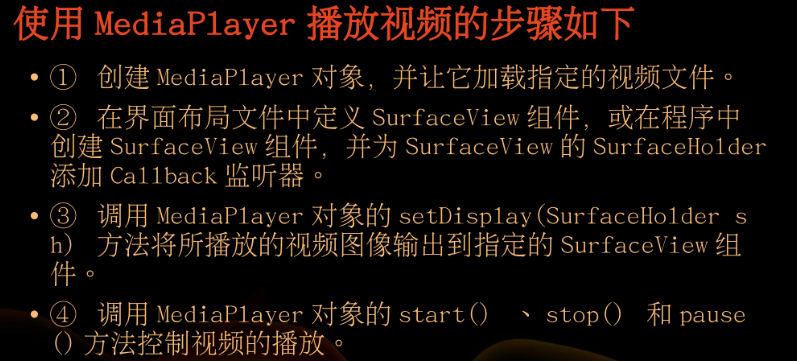
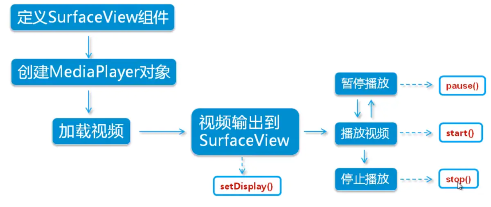

[Android监听横竖屏切换 - 简书](https://www.jianshu.com/p/85a87182de6d)


Mediaplayer用来播放音频，没有提供图形输出界面。

SurfaceView来显示Mediaplayer播放的图像输出。

# 1、使用Mediaplayer播放视频的步骤




# 2、MediaRecorder.AudioEncoder包含的编译解码器

常用方法

```java
获取第一次调用此方法之后录音出现的最大振幅
    public native int getMaxAmplitude() throws IllegalStateException;
准备录制
    prepare();
释放资源
    release();
设置为空闲状态
    reset();
设置录制的音频通道数
    public void setAudioChannels(int numChannels)
    设置所录制声音的编码格式
    public native void setAudioEncoder(int audio_encoder)
    编码位率
    public void setAudioEncodingBitRate(int bitRate)
    声音的采样率
    public void setAudioSamplingRate(int samplingRate)
    设置声音来源
    public native void setAudioSource(@Source int audioSource)
```


# 3、使用步骤



```xml
<?xml version="1.0" encoding="utf-8"?>
<LinearLayout xmlns:android="http://schemas.android.com/apk/res/android"
    xmlns:app="http://schemas.android.com/apk/res-auto"
    xmlns:tools="http://schemas.android.com/tools"
    android:layout_width="match_parent"
    android:layout_height="match_parent"
    android:orientation="vertical"
    tools:context=".MainActivity">

   <SurfaceView
       android:id="@+id/surfaceView"
       android:layout_width="wrap_content"
       android:layout_height="wrap_content"
       android:layout_weight="10"/>

    <LinearLayout
        android:layout_width="match_parent"
        android:layout_height="wrap_content"
        android:layout_weight="1"
        android:orientation="horizontal"
        >

        <Button
            android:id="@+id/play"
            android:text="play"
            android:layout_width="wrap_content"
            android:layout_height="wrap_content"
            android:layout_weight="1"/>

        <Button
            android:layout_weight="1"
            android:text="pasue"
            android:id="@+id/pasue"
            android:layout_width="wrap_content"
            android:layout_height="wrap_content" />
        <Button
            android:layout_weight="1"
            android:text="stop"
            android:id="@+id/stop"
            android:layout_width="wrap_content"
            android:layout_height="wrap_content" />

    </LinearLayout>

</LinearLayout>
```

```java
package com.lindingdu.app03;

import android.media.AudioAttributes;
import android.media.AudioManager;
import android.media.MediaPlayer;
import android.os.Environment;
import android.support.v7.app.AppCompatActivity;
import android.os.Bundle;
import android.view.SurfaceHolder;
import android.view.SurfaceView;
import android.view.View;
import android.view.WindowManager;
import android.widget.Button;
import android.widget.Toast;

import java.io.IOException;

public class MainActivity extends AppCompatActivity {

    private Button play,pause,stop;
    private Boolean noPlay=true;//定义播放状态
    private MediaPlayer mediaPlayer;
    private SurfaceHolder surfaceHolder;

    @Override
    protected void onCreate(Bundle savedInstanceState) {
        super.onCreate(savedInstanceState);
        setContentView(R.layout.activity_main);

        getWindow().setFlags(WindowManager.LayoutParams.FLAG_FULLSCREEN
                ,WindowManager.LayoutParams.FLAG_FULLSCREEN);//全屏显示

        //控制视频的按钮
        play=findViewById(R.id.play);
        pause=findViewById(R.id.pasue);
        stop=findViewById(R.id.stop);

        SurfaceView surfaceView=findViewById(R.id.surfaceView);
        surfaceHolder=surfaceView.getHolder();//获取surfaceHolder
        mediaPlayer=new MediaPlayer();//创建MediaPlayer对象
        mediaPlayer.setAudioStreamType(AudioManager.STREAM_MUSIC);//设置多媒体类型
        //播放
        play.setOnClickListener(new View.OnClickListener() {
            @Override
            public void onClick(View v) {

                if(noPlay){
                    play();
                    noPlay=false;
                }else{
                  mediaPlayer.start();//继续播放视频
                }
            }
        });
        //暂停
        pause.setOnClickListener(new View.OnClickListener() {
            @Override
            public void onClick(View v) {

                if(mediaPlayer.isPlaying()){
                    mediaPlayer.pause();
                }
           }
        });
        //停止
        stop.setOnClickListener(new View.OnClickListener() {
            @Override
            public void onClick(View v) {
                if(mediaPlayer.isPlaying()){
                    mediaPlayer.stop();
                    noPlay=true;//视频处于没有播放状态
                }
            }
        });
        mediaPlayer.setOnCompletionListener(new MediaPlayer.OnCompletionListener() {
            @Override
            public void onCompletion(MediaPlayer mp) {
                Toast.makeText(MainActivity.this, "视频播放完毕", Toast.LENGTH_SHORT).show();
            }
        });
    }
    public void play(){

        mediaPlayer.reset();//重置MediaPlayer
        mediaPlayer.setDisplay(surfaceHolder);//把视频画面输出到SurfaceView中

        try {
            mediaPlayer.setDataSource(Environment.
                    getExternalStorageDirectory()+"/a.mp4");//设置要播放的内容在根目录下的位置
            mediaPlayer.prepare();//预加载

        } catch (Exception e) {
            e.printStackTrace();
        }

        mediaPlayer.start();

    }

    @Override
    protected void onDestroy() {
        if(mediaPlayer!=null){
            if(mediaPlayer.isPlaying()){
                mediaPlayer.stop();
            }
            mediaPlayer.release();
        }
        super.onDestroy();
    }
}
```

```xml
    <uses-permission android:name="android.permission.MOUNT_UNMOUNT_FILESYSTEMS"
        tools:ignore="ProtectedPermissions" />
    <uses-permission android:name="android.permission.WRITE_EXTERNAL_STORAGE"/>
```