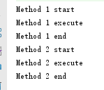
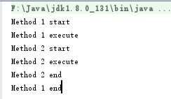
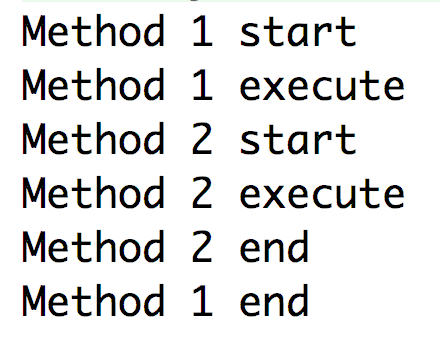
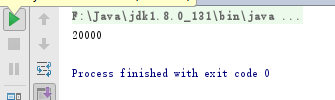
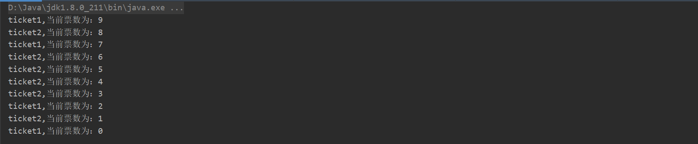
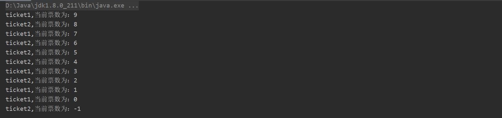
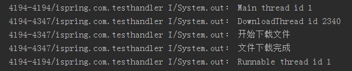

# 1、继承Thread类

```java
class MyThread extends Thread {
    @Override
    public void run() {
        super.run();
        System.out.println("run MyThread");
    }
}

new MyThread().run();
```


# 2、实现Runnable接口

```java
class MyRunnable implements Runnable {
    @Override
    public void run() {
        System.out.println("run MyRunnable");
    }
}

new Thread(new MyRunnable()).run();
```


#  **3、synchronized** 的应用——共享数据

> 参考——[【Java并发编程之深入理解】Synchronized的使用_Java_张静怡-CSDN博客](https://blog.csdn.net/zjy15203167987/article/details/82531772)

 synchronized可以保证方法或者代码块在运行时，同一时刻只有一个方法可以进入到临界区，同时它还可以保证共享变量的内存可见性 

## 3.1 synchronized的三种应用方式

Java中每一个对象都可以作为锁，这是synchronized实现同步的基础：

1. 普通同步方法（实例方法），锁是当前实例对象 ，进入同步代码前要获得当前实例的锁
2. 静态同步方法，锁是当前类的class对象 ，进入同步代码前要获得当前类对象的锁
3. 同步方法块，锁是括号里面的对象，对给定对象加锁，进入同步代码库前要获得给定对象的锁。


##  3.2 synchronized作用于实例方法

 ①多个线程访问同一个对象的同一个方法

```java
public class synchronizedTest implements Runnable {
    //共享资源
    static int i =0;
    /**
     * synchronized 修饰实例方法
     */
    public synchronized void increase(){
        i++;
    }
    @Override
    public void run(){
        for (int j =0 ; j<10000;j++){
            increase();
        }
    }

    public static void main(String[] args) throws InterruptedException {
        synchronizedTest test = new synchronizedTest();
        Thread t1 = new Thread(test);
        Thread t2 = new Thread(test);
        t1.start();
        t2.start();
        t1.join();
        t2.join();
        System.out.println("i = " + i);
    }
}
```

**注意： for (int j =0 ; j<10000;j++)**

- 不加**synchronized**输出`I/System.out: i = 11568`
- 加上**synchronized**输出`I/System.out: i = 20000`

==分析：当两个线程同时对一个对象的一个方法进行操作，只有一个线程能够抢到锁。因为一个对象只有一把锁，一个线程获取了该对象的锁之后，其他线程无法获取该对象的锁，就不能访问该对象的其他synchronized实例方法，但是可以访问非synchronized修饰的方法 。==

 ② 一个线程获取了该对象的锁之后，其他线程来访问其他synchronized实例方法现象

```java
public class SynchronizedTest {
    public synchronized void method1() {
        System.out.println("Method 1 start");
        try {
            System.out.println("Method 1 execute");
            Thread.sleep(3000);
        } catch (InterruptedException e) {  
            e.printStackTrace();
        }
        System.out.println("Method 1 end");
    }

    public synchronized void method2() {
        System.out.println("Method 2 start");
        try {
            System.out.println("Method 2 execute");
            Thread.sleep(1000);
        } catch (InterruptedException e) {
            e.printStackTrace();
        }
        System.out.println("Method 2 end");
    }


    public static void main(String[] args) {
        final SynchronizedTest test = new SynchronizedTest();

        new Thread(test::method1).start();

        new Thread(test::method2).start();
    }

}
```


结果：




 ==分析：可以看出其他线程来访问synchronized修饰的其他方法时需要等待线程1先把锁释放==


 ③一个线程获取了该对象的锁之后，其他线程来访问其他非synchronized实例方法现象 

```java
public class SynchronizedTest {
    public synchronized void method1() {
        System.out.println("Method 1 start");
        try {
            System.out.println("Method 1 execute");
            Thread.sleep(3000);
        } catch (InterruptedException e) {
            e.printStackTrace();
        }
        System.out.println("Method 1 end");
    }

    public void method2() {
        System.out.println("Method 2 start");
        try {
            System.out.println("Method 2 execute");
            Thread.sleep(1000);
        } catch (InterruptedException e) {
            e.printStackTrace();
        }
        System.out.println("Method 2 end");
    }


    public static void main(String[] args) {
        final SynchronizedTest test = new SynchronizedTest();

        new Thread(test::method1).start();
        new Thread(test::method2).start();
    }

}
```


结果：



 ==分析：当线程1还在执行时，线程2也执行了，所以当其他线程来访问非synchronized修饰的方法时是可以访问的==

 ④当多个线程作用于不同的对象 

```java
public class SynchronizedTest {
    public synchronized void method1() {
        System.out.println("Method 1 start");
        try {
            System.out.println("Method 1 execute");
            Thread.sleep(3000);
        } catch (InterruptedException e) {
            e.printStackTrace();
        }
        System.out.println("Method 1 end");
    }

    public synchronized void method2() {
        System.out.println("Method 2 start");
        try {
            System.out.println("Method 2 execute");
            Thread.sleep(1000);
        } catch (InterruptedException e) {
            e.printStackTrace();
        }
        System.out.println("Method 2 end");
    }


    public static void main(String[] args) {
        final SynchronizedTest test1 = new SynchronizedTest();
        final SynchronizedTest test2 = new SynchronizedTest();

        new Thread(test1::method1).start();

        new Thread(test2::method2).start();
    }

}
```


结果：




 ==分析：因为两个线程作用于不同的对象，获得的是不同的锁，所以互相并不影响==


##  3.3 synchronized作用于静态方法

```java
public class synchronizedTest implements Runnable {
    //共享资源
    static int i =0;
    /**
     * synchronized 修饰实例方法
     */
    public static synchronized void increase(){
        i++;
    }
    @Override
    public void run(){
        for (int j =0 ; j<10000;j++){
            increase();
        }
    }

    public static void main(String[] args) throws InterruptedException {
        Thread t1 = new Thread(new synchronizedTest());
        Thread t2 = new Thread(new synchronizedTest());
        t1.start();
        t2.start();
        t1.join();
        t2.join();
        System.out.println(i);
    }

```

结果：




==分析：由例子可知，两个线程实例化两个不同的对象，但是访问的方法是静态的，两个线程发生了互斥（即一个线程访问，另一个线程只能等着），因为静态方法是依附于类而不是对象的，当synchronized修饰静态方法时，锁是class对象。==

## 3.4  synchronized作用于同步代码块 

1. synchronized (this)

```java
public class Ticket implements Runnable {
    private int ticket = 10;

    @Override
    public void run() {
        while (ticket > 0) {
            synchronized (this) {
                ticket--;

                try {
                    Thread.sleep(100);
                } catch (InterruptedException e) {
                    e.printStackTrace();
                }
                System.out.println(Thread.currentThread().getName() + ",当前票数为：" + ticket);
            }
        }
    }

    public static void main(String[] args) {
        Ticket t = new Ticket();
        new Thread(t, "ticket1").start();
        new Thread(t, "ticket2").start();
    }
}

```



2. synchronized (this)

```java
改为 synchronized (Ticket.class) {
```




分析：将synchronized作用于一个给定的实例对象instance，即当前实例对象就是锁对象，每次当线程进入synchronized包裹的代码块时就会要求当前线程持有instance实例对象锁，如果当前有其他线程正持有该对象锁，那么新到的线程就必须等待，这样也就保证了每次只有一个线程执行i++;操作。当然除了instance作为对象外，我们还可以使用this对象(代表当前实例)或者当前类的class对象作为锁，如下代码

```java
//this,当前实例对象锁
synchronized(this){
    for(int j=0;j<1000000;j++){
        i++;
    }
}

//class对象锁
synchronized(AccountingSync.class){
    for(int j=0;j<1000000;j++){
        i++;
    }
}

```


# 4、Android中Handler的使用


> 参考——[Android中Handler的使用_移动开发_孙群-CSDN博客](https://blog.csdn.net/iispring/article/details/47115879?depth_1-utm_source=distribute.pc_relevant.none-task&utm_source=distribute.pc_relevant.none-task)


在Android应用启动时，会自动创建一个线程，即程序的主线程，主线程负责UI的展示、UI事件消息的派发处理等等，因此主线程也叫做UI线程， statusTextView是在UI线程中创建的，当我们在DownloadThread线程中去更新UI线程中创建的statusTextView时自然会报错误（ `Only the original thread that created a view hierarchy can touch its views.` ）。Android的UI控件是非线程安全的，其实很多平台的UI控件都是非线程安全的，比如C#的.Net Framework中的UI控件也是非线程安全的，所以不仅仅在Android平台中存在从一个新线程中去更新UI线程中创建的UI控件的问题。不同的平台提供了不同的解决方案以实现跨线程跟新UI控件，**Android为了解决这种问题引入了Handler机制。**

```java
@Override
protected void onCreate(Bundle savedInstanceState) {
    super.onCreate(savedInstanceState);
    setContentView(R.layout.activity_main);
    statusTextView = (TextView)findViewById(R.id.statusTextView);
    Button btnDownload = (Button)findViewById(R.id.btnDownload);
    btnDownload.setOnClickListener(this);
}

@Override
public void onClick(View v) {
    DownloadThread downloadThread = new DownloadThread();
    downloadThread.start();
}

class DownloadThread extends Thread{
    @Override
    public void run() {
        try{
            System.out.println("开始下载文件");
            //此处让线程DownloadThread休眠5秒中，模拟文件的耗时过程
            Thread.sleep(5000);
            System.out.println("文件下载完成");
            //文件下载完成后更新UI
            MainActivity.this.statusTextView.setText("文件下载完成");
        }catch (InterruptedException e){
            e.printStackTrace();
        }
    }
}

```


Handler可以用来在多线程间进行通信，在另一个线程中去更新UI线程中的UI控件只是Handler使用中的一种典型案例，除此之外，Handler可以做很多其他的事情。每个Handler都绑定了一个线程，假设存在两个线程ThreadA和ThreadB，并且HandlerA绑定了 ThreadA，在ThreadB中的代码执行到某处时，出于某些原因，我们需要让ThreadA执行某些代码，此时我们就可以使用Handler，我们可以在ThreadB中向HandlerA中加入某些信息以告知ThreadA中该做某些处理了。由此可以看出，Handler是Thread的代言人，是多线程之间通信的桥梁，通过Handler，我们可以在一个线程中控制另一个线程去做某事。

 Handler提供了两种方式解决我们在本文一开始遇到的问题（在一个新线程中更新主线程中的UI控件），一种是通过post方法，一种是调用sendMessage方法。 


1. post方式

```java
package com.zzu.rensiyu.mylearn;

import android.os.Bundle;
import android.os.Handler;
import android.view.View;

import androidx.appcompat.app.AppCompatActivity;

public class MainActivity extends AppCompatActivity implements View.OnClickListener {


    //uiHandler在主线程中创建，所以自动绑定主线程
    private Handler uiHandler = new Handler();

    @Override
    protected void onCreate(Bundle savedInstanceState) {
        super.onCreate(savedInstanceState);
        setContentView(R.layout.activity_main);


    }

    @Override
    public void onClick(View v) {
        DownloadThread downloadThread = new DownloadThread();
        downloadThread.start();
    }


    class DownloadThread extends Thread {

       @Override
        public void run() {
            try{
                System.out.println("DownloadThread id " + Thread.currentThread().getId());
                System.out.println("开始下载文件");
                //此处让线程DownloadThread休眠5秒中，模拟文件的耗时过程
                Thread.sleep(5000);
                System.out.println("文件下载完成");
                //文件下载完成后更新UI
                Runnable runnable = new Runnable() {
                    @Override
                    public void run() {
                        System.out.println("Runnable thread id " + Thread.currentThread().getId());
                        MainActivity.this.statusTextView.setText("文件下载完成");
                    }
                };
                uiHandler.post(runnable);
            }catch (InterruptedException e){
                e.printStackTrace();
            }
        }
    }
}

```


我们在Activity中创建了一个Handler成员变量uiHandler，Handler有个特点，在执行new Handler()的时候，默认情况下Handler会绑定当前代码执行的线程，我们在主线程中实例化了uiHandler，所以uiHandler就自动绑定了主线程，即UI线程。当我们在DownloadThread中执行完耗时代码后，我们将一个Runnable对象通过post方法传入到了Handler中，Handler会在合适的时候让主线程执行Runnable中的代码，这样Runnable就在主线程中执行了，从而正确更新了主线程中的UI。以下是输出结果：



通过输出结果可以看出，Runnable中的代码所执行的线程ID与DownloadThread的线程ID不同，而与主线程的线程ID相同，因此我们也由此看出在执行了Handler.post(Runnable)这句代码之后，运行Runnable代码的线程与Handler所绑定的线程是一致的，而与执行Handler.post(Runnable)这句代码的线程（DownloadThread）无关。


2. sendMessage方式

   ```java
   package com.zzu.rensiyu.mylearn;
   
   import android.os.Bundle;
   import android.os.Handler;
   import android.os.Message;
   import android.view.View;
   
   import androidx.appcompat.app.AppCompatActivity;
   
   public class MainActivity extends AppCompatActivity implements View.OnClickListener {
   
   
       private Handler handler = new Handler() {
           @Override
           public void handleMessage(Message msg) {
               switch (msg.what) {
                   case 1:
                       System.out.println("handleMessage thread id " + Thread.currentThread().getId());
                       System.out.println("msg.arg1:" + msg.arg1);
                       System.out.println("msg.arg2:" + msg.arg2);
                       MainActivity.this.statusTextView.setText("文件下载完成");
                       break;
               }
           }
       };
   
       @Override
       protected void onCreate(Bundle savedInstanceState) {
           super.onCreate(savedInstanceState);
           setContentView(R.layout.activity_main);
   
   
       }
   
       @Override
       public void onClick(View v) {
           DownloadThread downloadThread = new DownloadThread();
           downloadThread.start();
       }
   
   
       class DownloadThread extends Thread {
   
           @Override
           public void run() {
               try {
                   System.out.println("DownloadThread id " + Thread.currentThread().getId());
                   System.out.println("开始下载文件");
                   //此处让线程DownloadThread休眠5秒中，模拟文件的耗时过程
                   Thread.sleep(5000);
                   System.out.println("文件下载完成");
                   //文件下载完成后更新UI
                   Message msg = new Message();
                   //虽然Message的构造函数式public的，我们也可以通过以下两种方式通过循环对象获取Message
                   msg = Message.obtain(handler);
                   msg = handler.obtainMessage();
   
                   //what是我们自定义的一个Message的识别码，以便于在Handler的handleMessage方法中根据what识别
                   //出不同的Message，以便我们做出不同的处理操作
                   msg.what = 1;
   
                   //我们可以通过arg1和arg2给Message传入简单的数据
                   msg.arg1 = 123;
                   msg.arg2 = 321;
                   //我们也可以通过给obj赋值Object类型传递向Message传入任意数据
                   msg.obj = null;
                   //我们还可以通过setData方法和getData方法向Message中写入和读取Bundle类型的数据
                   msg.setData(null);
                   Bundle data = msg.getData();
   
                   //将该Message发送给对应的Handler
                   handler.sendMessage(msg);
               } catch (InterruptedException e) {
                   e.printStackTrace();
               }
           }
       }
   }
   
   ```

   