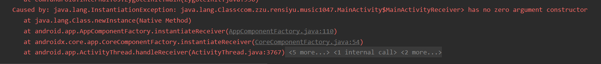

# 歌词篇


Flyme 4自带音乐是在ListView里显示，内部嵌套了多个TextView，一行一行显示歌词，支持滑动到某个位置之后跳转到该位置播放（魅族的UI做得的确很不错）

MIUI 6自带音乐的实现方式略奇葩，在ScrollView里嵌套了三个TextView，分别显示之前的所有歌词，当前显示的歌词和之后的所有歌词。实现起来很容易，但是效果不够理想，也不支持跳转播放

还有其他的实现方式，比如在自定义View里重载onDraw方法，自己绘制歌词……这样比较精确，但要支持滑动之后跳转播放的话难度很大。

还是用ScrollView实现吧……


> [Android中歌词显示的实现_移动开发_entalent的专栏-CSDN博客](https://blog.csdn.net/entalent/article/details/45456773)
>
> [android 实现歌词自动滚动+手指顺畅拖动 - 简书](https://www.jianshu.com/p/f251bda684e8)
>
> 


# 更新seekbar

[android 更新歌曲播放进度条seekbar的三种方法_移动开发_heyzqt-CSDN博客](https://blog.csdn.net/sinat_24946363/article/details/51494581)


# Toolbar

```xml
    <androidx.appcompat.widget.Toolbar
        android:id="@+id/toolbar"
        android:layout_width="match_parent"
        android:layout_height="wrap_content"
        android:background="?attr/colorPrimary"
        android:theme="@style/toolbar"
        app:popupTheme="@style/ToolbarPopupTheme"
        app:titleTextColor="@android:color/white">

    </androidx.appcompat.widget.Toolbar>
```


1. 一定要导入包`androidx.appcompat.widget.Toolbar`

2. 在自定义主题的情况下
   `android:theme="@style/toolbar`可以替换成 `app:popupTheme="@style/Theme.AppCompat.Light.NoActionBar`
   或者：

   ```xml
   <!-- Base application theme. -->
   <style name="AppTheme" parent="Theme.AppCompat.Light.NoActionBar">
       <!-- Customize your theme here. -->
       <item name="colorPrimary">@color/colorPrimary</item>
       <item name="colorPrimaryDark">@color/colorPrimaryDark</item>
       <!-- <item name="colorAccent">@color/colorAccent</item>-->
   </style>
   <style name="NoBarTheme">
       <item name="android:windowActionBar">false</item>//无bar
       <item name="android:windowNoTitle">true</item>//没有title
   </style>
   
   ```

3. 在activity中设置

```java
        toolbar = findViewById(R.id.toolbar);
        toolbar.setTitle("曲库");
//        toolbar.setSubtitle("SubTitle");
//        toolbar.setLogo(R.mipmap.ic_launcher);

        //设置导航图标要在setSupportActionBar方法之后
        setSupportActionBar(toolbar);
//        toolbar.setNavigationIcon(R.drawable.arrow_left);

        //设置导航图标、添加菜单点击事件要在setSupportActionBar方法之后
//        setSupportActionBar(toolbar);
        toolbar.setNavigationIcon(R.mipmap.list1);
```


# 音乐播放列表

参考——[android中自定义ListView界面_移动开发_JiaWei-CSDN博客](https://blog.csdn.net/qq_40962416/article/details/82114063)


# 读取Asset文件


在很多时候，我们需要访问android中的资源文件，这些资源文件主要分为两类，一种出于asset目录下，称为原生文件，这类文件在被打包成apk文件时是不会进行压缩的；另一类则是res下的文件，这类文件在打包成apk文件时，会进行小内存优化的哦。

**res/raw和assets的相同点：**

1.两者目录下的文件在打包后会原封不动的保存在apk包中，不会被编译成二进制。

**res/raw和assets的不同点：**
1.res/raw中的文件会被映射到R.java文件中，访问的时候直接使用资源ID即R.id.filename；assets文件夹下的文件不会被映射到R.java中，访问的时候需要AssetManager类。
2.res/raw不可以有目录结构，而assets则可以有目录结构，也就是assets目录下可以再建立文件夹

  两种不同类型的文件，对应着不同的访问模式。我们先来看看asset文件的访问：

     android中有一个专门的类来处理应用对asset文件的访问，这个类就是AssetManager。
     其内有一个open()方法可以根据用户提供的文件名，返回一个InputStream对象供用户使用。


ACCESS_BUFFER ：加载文件到内存中，这种方式适合小文件的读取；

ACCESS_RANDOM:可以随意的向前或者向后的读取数据块

ACCESS_STRAMING:顺序的读取内容

ACCESS_UNKNOWN:当没有明确指定时，使用默认模式

这里我们一定要注意，open(String fileName)默认的使用ACCESS_STREAMING模式进行读取！！

那么我们如何获得一个AssetManager对象呢，在activity中我们可以通过以下的代码获取：

```
AssetManager assetManager = this.getResources().getAsset();
```


比如访问phoneImage文件夹下面的内容.


```java
String[] files = getApplicationContext().getAssets().list("phoneImage");
bit = BitmapFactory.decodeStream(getApplicationContext().getAssets().
                                 open("phoneImage/"+files[0]));
```
注意phoneImage前面没有/符号,我一直犯下的就是这个错误。希望你们不要犯错。


**访问res/raw下面的资源**

我们再activity中可以通过如下方法进行访问，

`InputStream inputStream = Resources.openRawResource(int id);`


# 字符串匹配

[Java 正则表达式 | 菜鸟教程](https://www.runoob.com/java/java-regular-expressions.html)


# Service和Fragment之间的通信及消息监听

> [Service和Fragment之间的通信及消息监听 - 简书](https://www.jianshu.com/p/d9af55834337)


# 报错


## class has no zero argument constructor




# 自定义TextView


# 抽屉布局 ——自定义侧边栏

[2.6.4 DrawerLayout(官方侧滑菜单)的简单使用 | 菜鸟教程](https://www.runoob.com/w3cnote/android-tutorial-drawerlayout.html)

[使用Android DrawerLayout实现侧边栏功能_移动开发_猛龙过江ing-CSDN博客](https://blog.csdn.net/weixin_38141453/article/details/83686134?depth_1-utm_source=distribute.pc_relevant.none-task&utm_source=distribute.pc_relevant.none-task)

[浅谈DrawerLayout(抽屉效果) - 听着music睡 - 博客园](https://www.cnblogs.com/xqxacm/p/5319258.html)

[小记DrawerLayout点击事件传递 - 简书](https://www.jianshu.com/p/385f007f10d4)

[DrawerLayout侧滑布局点击不响应事件_ch1406285246的博客-CSDN博客](https://blog.csdn.net/ch1406285246/article/details/78665263?depth_1-utm_source=distribute.pc_relevant.none-task&utm_source=distribute.pc_relevant.none-task)

已经解决点击不响应


[Android 官方 switch 控件更改选中色 - 简书](https://www.jianshu.com/p/0fcb6c20357c)


# 旋转图片

[Android 围绕中心旋转动画 - 简书](https://www.jianshu.com/p/7b5ad585baf0)

[Android中的Interpolator - 圣骑士wind - 博客园](https://www.cnblogs.com/mengdd/p/3346003.html)