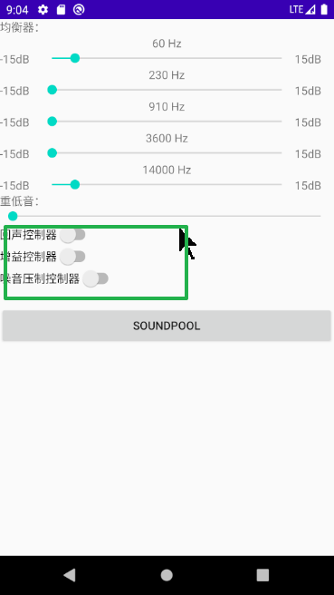
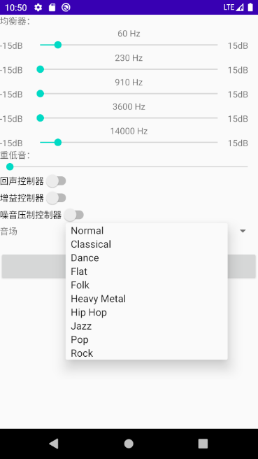

**AudioEffect是控制android音频框架提供的音频效果的基类。**

应用程序不应直接使用AudioEffect类，而应使用其派生类之一来控制特定效果：

```
AcousticEchoCanceler	取消回声控制器
AutomaticGainControl	自动增益控制器
NoiseSuppressor			噪音压制控制器
Equalizer 				均衡控制器
Virtualizer				示波器
BassBoost				重低音控制器
PresetReverb			预设音场控制器
EnvironmentalReverb	
DynamicsProcessing	

```


# 音乐特效控制

AcousticEchoCanceler	取消回声控制器
AutomaticGainControl	自动增益控制器
NoiseSuppressor			噪音压制控制器
这三个用法很简单：

1. 调用creat()方法，创建相应的实例。
2. 调用他们的isAvailable();方法判断是否可用。
3. 再调用setEnabled(Boolean enabled)方法启用相应的效果。


# 一、AcousticEchoCanceler:回声消除器

回声消除器的用法相当简单，只要调用它的静态方法创建相应的实例即可调用。但是需要注意的是：不是所有的手机都支持这个功能，所以我们在使用之前应该提前调用isAvailabel()方法判断是否可用。

```java
aSwitch1 = findViewById(R.id.switchAcousticEchoCanceler);
canceler = AcousticEchoCanceler.create(mediaPlayer.getAudioSessionId());
aSwitch1.setOnCheckedChangeListener(new CompoundButton.OnCheckedChangeListener() {
    @Override
    public void onCheckedChanged(CompoundButton buttonView, boolean isChecked) {
        if (isChecked) {
            if (AcousticEchoCanceler.isAvailable()) {
                canceler.setEnabled(true);
            } else {
                buttonView.setChecked(false);
                Toast.makeText(MainActivity.this, "您的手机不支持回声控制", Toast.LENGTH_SHORT).show();
            }
        } else {
            if (AcousticEchoCanceler.isAvailable()) {
                canceler.setEnabled(true);
            }
        }
    }
});


```

# 二、AutomaticGainControl:自动增强控制器

```java
aSwitch2 = findViewById(R.id.switchAutomaticGainControl);
control = AutomaticGainControl.create(mediaPlayer.getAudioSessionId());
aSwitch2.setOnCheckedChangeListener(new CompoundButton.OnCheckedChangeListener() {
    @Override
    public void onCheckedChanged(CompoundButton buttonView, boolean isChecked) {
        if (isChecked) {
            if (AutomaticGainControl.isAvailable()) {
                control.setEnabled(true);
            } else {
                buttonView.setChecked(false);
                Toast.makeText(MainActivity.this, "您的手机不支持增强", Toast.LENGTH_SHORT).show();
            }
        } else {
            if (AutomaticGainControl.isAvailable()) {
                control.setEnabled(false);
            }
        }
    }
});
```


# 三、NoiseSuppressor:噪音抑制器

```java

aSwitch3 = findViewById(R.id.switchNoiseSuppressor);
suppressor = NoiseSuppressor.create(mediaPlayer.getAudioSessionId());
aSwitch3.setOnCheckedChangeListener(new CompoundButton.OnCheckedChangeListener() {
    @Override
    public void onCheckedChanged(CompoundButton buttonView, boolean isChecked) {
        if (isChecked) {
            if (NoiseSuppressor.isAvailable()) {
                suppressor.setEnabled(true);
            } else {
                buttonView.setChecked(false);
                Toast.makeText(MainActivity.this, "您的手机不支持降噪", Toast.LENGTH_SHORT).show();
            }
        } else {
            if (NoiseSuppressor.isAvailable()) {
                control.setEnabled(false);
            }
        }
    }
});
```




# 四、BassBoost:重低音调节器

Android中给重低音调节器设置了1000个级别，也就是当我们的seekBar的最大值就是1000。接下来我们看一看重低音调节器的用法

```java
 private void setupBassBoost() {
     	//其第一个参数代表该音效控制器的优先级，这里设置为0，第二个参数仍然是MediaPlayer的id。
        bassBoost = new BassBoost(0, mediaPlayer.getAudioSessionId());
        bassBoost.setEnabled(true);
        mBassSeekBar = findViewById(R.id.mBassSeekBar);
        mBassSeekBar.setMax(1000);
        mBassSeekBar.setProgress(0);
        mBassSeekBar.setOnSeekBarChangeListener(new SeekBar.OnSeekBarChangeListener() {
            @Override
            public void onProgressChanged(SeekBar seekBar, int progress, boolean fromUser) {
                // 设置重低音的强度
                bassBoost.setStrength((short) progress);
            }

            @Override
            public void onStartTrackingTouch(SeekBar seekBar) {
            }

            @Override
            public void onStopTrackingTouch(SeekBar seekBar) {
            }
        });
```

# 五、Equalizer:均衡器

简单说明一下均衡器的原理：调整某一频率声音的分贝。
所以我们在使用均衡器之前需要先获取当前系统支持的所有可调整的频率，从我上面的截图可以看出我的手机目前仅支持60、230、910、3600、14000Hz这些频率。

1. 获取能够设置的最小和最大分贝数 

   ```java
   short minEQLevel = equalizer.getBandLevelRange()[0];
   short maxEQLevel = equalizer.getBandLevelRange()[1];
   ```

2.  获取均衡器支持的所有频率 
   

   ```java
   equalizer.getNumberOfBands()
   ```

3.  针对每一种频率设置布局并给SeekBar设置滑动事件 

   ```java
    for (short i = 0; i < equalizerSeekBarList.size(); i++) {
               equalizerSeekBarTextViewList.get(i).setText(equalizer.getCenterFreq(i) / 1000 + " Hz");
               SeekBar bar = equalizerSeekBarList.get(i);
               bar.setMax(maxEQLevel - minEQLevel);
               bar.setProgress(equalizer.getBandLevel(i));
               final short brand = i;
               bar.setOnSeekBarChangeListener(new SeekBar.OnSeekBarChangeListener() {
                   @Override
                   public void onProgressChanged(SeekBar seekBar, int i, boolean b) {
                       equalizer.setBandLevel(brand, (short) (i + minEQLevel));
                   }
   
                   @Override
                   public void onStartTrackingTouch(SeekBar seekBar) {
                   }
   
                   @Override
                   public void onStopTrackingTouch(SeekBar seekBar) {
                   }
               });
           }
   ```

   

# 六、PresetReverb:预设音场控制器

```java
private void setPresetReverb() {
    spinner = findViewById(R.id.presetReverb);
    presetReve rb = new PresetReverb(0, mediaPlayer.getAudioSessionId());
    List<String> list = new ArrayList<>();
    for (int i = 0; i < equalizer.getNumberOfPresets(); i++) {
        list.add(equalizer.getPresetName((short) i));
    }
    spinner.setAdapter(new ArrayAdapter<String>(this, android.R.layout.simple_spinner_item, list));
    spinner.setOnItemSelectedListener(new AdapterView.OnItemSelectedListener() {
        @Override
        public void onItemSelected(AdapterView<?> parent, View view, int position, long id) {
            equalizer.usePreset((short) position);
        }

        @Override
        public void onNothingSelected(AdapterView<?> parent) {

        }
    });
}
```




# SoundPool 

是 Android 提供的一个API类，用来播放简短的音频，使用简单但功能相对强大。只需花很少的气力，就可以完成音频的播放、暂停、恢复及停止等操作。从名字上也可以看出，它是一个“pool”，我们可以加载多个音频资源到内存，进行管理与播放，比如控制同时播放流的最大数目。

加载资源到内存是需要花费少许时间的，因此我们需要监听加载资源完毕的事件，在加载完毕后才能进行播放，以免发生不可预期的错误。

除了以上介绍外，SoundPool 还有诸多其他功能，诸如调节左右声道的音量值、调整播放的语速、设置播放的优先级以及播放的次数等等，说起来还是挺有意思的。接下来述说 SoundPool 的具体使用。

## 一、SoundPool相对于MediaPlayer的优点

 1.SoundPool适合 短且对反应速度比较高 的情况（游戏音效或按键声等），文件大小一般控制在几十K到几百K，最好不超过1M，
 2.SoundPool   可以与MediaPlayer同时播放，SoundPool也可以同时播放多个声音；
 3.SoundPool 最终编解码实现与MediaPlayer相同；
 4.MediaPlayer只能同时播放一个声音，加载文件有一定的时间，适合文件比较大，响应时间要是那种不是非常高的场景

 ## 二、SoundPool

```java
SoundPool soundPool;  
//实例化SoundPool

//sdk版本21是SoundPool 的一个分水岭
if (Build.VERSION.SDK_INT >= 21) {
    SoundPool.Builder builder = new SoundPool.Builder();
    //传入最多播放音频数量,
    builder.setMaxStreams(1);
    //AudioAttributes是一个封装音频各种属性的方法
    AudioAttributes.Builder attrBuilder = new AudioAttributes.Builder();
    //设置音频流的合适的属性
    attrBuilder.setLegacyStreamType(AudioManager.STREAM_MUSIC);
    //加载一个AudioAttributes
    builder.setAudioAttributes(attrBuilder.build());
    soundPool = builder.build();
} else {
    /**
     * 第一个参数：int maxStreams：SoundPool对象的最大并发流数
     * 第二个参数：int streamType：AudioManager中描述的音频流类型
     *第三个参数：int srcQuality：采样率转换器的质量。 目前没有效果。 使用0作为默认值。
     */
    soundPool = new SoundPool(1, AudioManager.STREAM_MUSIC, 0);
}

//可以通过四种途径来记载一个音频资源：
//1.通过一个AssetFileDescriptor对象
//int load(AssetFileDescriptor afd, int priority) 
//2.通过一个资源ID
//int load(Context context, int resId, int priority) 
//3.通过指定的路径加载
//int load(String path, int priority) 
//4.通过FileDescriptor加载
//int load(FileDescriptor fd, long offset, long length, int priority) 
//声音ID 加载音频资源,这里用的是第二种，第三个参数为priority，声音的优先级*API中指出，priority参数目前没有效果，建议设置为1。
final int voiceId = soundPool.load(context, R.raw.sound, 1);
//异步需要等待加载完成，音频才能播放成功
soundPool.setOnLoadCompleteListener(new SoundPool.OnLoadCompleteListener() {
    @Override
    public void onLoadComplete(SoundPool soundPool, int sampleId, int status) {
        if (status == 0) {
            //第一个参数soundID
            //第二个参数leftVolume为左侧音量值（范围= 0.0到1.0）
            //第三个参数rightVolume为右的音量值（范围= 0.0到1.0）
            //第四个参数priority 为流的优先级，值越大优先级高，影响当同时播放数量超出了最大支持数时SoundPool对该流的处理
            //第五个参数loop 为音频重复播放次数，0为值播放一次，-1为无限循环，其他值为播放loop+1次
            //第六个参数rate为播放的速率，范围0.5-2.0(0.5为一半速率，1.0为正常速率，2.0为两倍速率)
            soundPool.play(voiceId, 1, 1, 1, 0, 1);
        }
    }
});
}
```